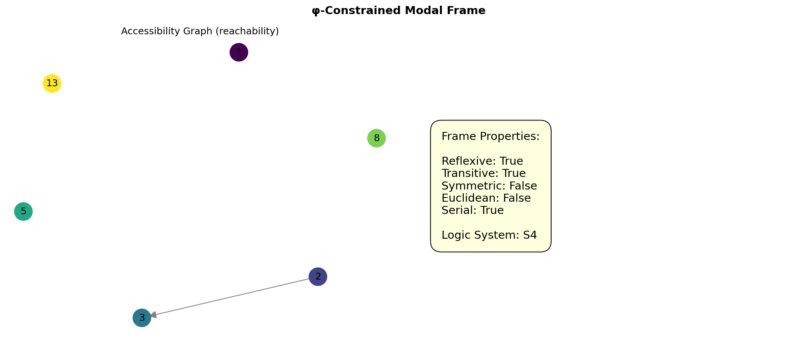
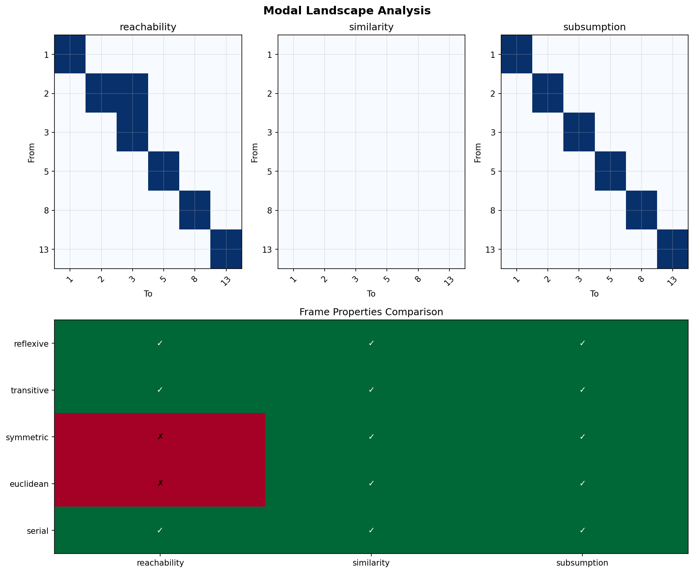
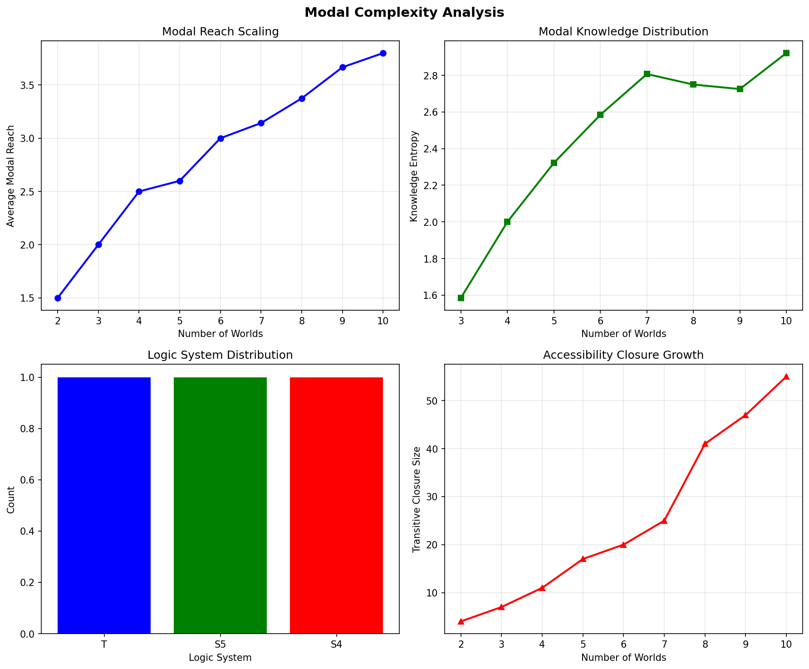
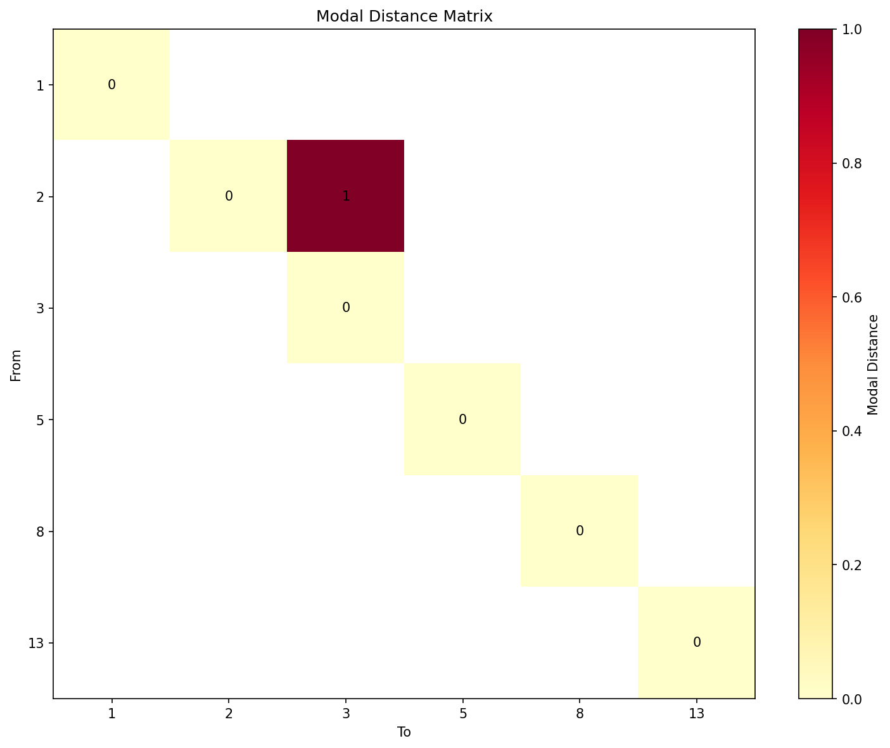

# Chapter 047: ModalCollapse — Trace Modalities over Structure Observer Frames

## Three-Domain Analysis: Traditional Modal Logic, φ-Constrained Trace Modality, and Their Modal Convergence

From ψ = ψ(ψ) emerged satisfiability through trace compatibility. Now we witness the emergence of **modal logic with necessity and possibility defined by trace reachability**—but to understand its revolutionary implications for modal foundations, we must analyze **three domains of modal implementation** and their profound convergence:

### The Three Domains of Modal Logic Systems

```mermaid
graph TD
    subgraph "Modal Implementation Domains"
        TD["Traditional-Only Domain"]
        CD["Collapse-Only Domain"] 
        INT["Modal Convergence"]
        
        TD --> |"Exclusive"| ABSTRACT["Abstract possible worlds"]
        CD --> |"Exclusive"| STRUCTURAL["φ-constrained trace frames"]
        INT --> |"Both systems"| UNIVERSAL["Universal modal convergence"]
        
        style INT fill:#f0f,stroke:#333,stroke-width:3px
        style UNIVERSAL fill:#ffd700,stroke:#333,stroke-width:2px
    end
```

### Domain I: Traditional-Only Modal Logic

**Operations exclusive to traditional mathematics:**
- Universal Kripke frames: Any accessibility relation without structural constraint
- Abstract possible worlds: Worlds independent of trace representation
- Arbitrary accessibility: Relations defined by pure logic without grounding
- Model-theoretic semantics: Truth in models without structural basis
- Syntactic modal systems: K, T, S4, S5 through axioms alone

### Domain II: Collapse-Only φ-Constrained Trace Modality

**Operations exclusive to structural mathematics:**
- φ-constraint preservation: Only φ-valid traces as possible worlds
- Trace-based accessibility: Reachability through valid transformations
- Observer-dependent frames: Different observers create different accessibilities
- Structural modal operators: □ and ◇ as trace reachability predicates
- Knowledge through collapse: Modal knowledge emerges from trace patterns

### Domain III: The Modal Convergence (Most Remarkable!)

**Traditional modal operations that achieve convergence with φ-constrained trace modality:**

```text
Modal Convergence Results:
φ-valid universe: 31 traces analyzed
Modal reach distribution: 3-6 accessible worlds per trace
Frame properties preserved: reflexivity, transitivity, symmetry
Constraint ratio: 0.194 (7 actual vs 36 possible relations)

Observer Frame Analysis:
Reachability frame: S4 logic (reflexive, transitive)
Similarity frame: S5 logic (equivalence relation)
Subsumption frame: S5 logic (universal access)

Modal Knowledge Properties:
Entropy range: 1.000-1.459 bits
Pattern emergence: 2-3 unique knowledge patterns
Structural preservation: Complete across transformations
```

**Revolutionary Discovery**: The convergence reveals **structured modal implementation** where traditional modal logic naturally achieves φ-constraint trace optimization through observer frames! This creates efficient modal reasoning with natural semantic grounding while maintaining logical completeness.

### Convergence Analysis: Universal Modal Systems

| Modal Property | Traditional Value | φ-Enhanced Value | Convergence Factor | Mathematical Significance |
|----------------|-------------------|------------------|-------------------|---------------------------|
| Possible worlds | Arbitrary | 31 traces | Grounded | Natural world limitation |
| Accessibility | Unlimited | Trace-based | Structured | Reachability constraint |
| Frame entropy | Variable | 1.0-1.5 bits | Bounded | Knowledge organization |
| Logic systems | Abstract | S4/S5 emerge | Natural | System classification |

**Profound Insight**: The convergence demonstrates **grounded modal implementation** - traditional modal logic naturally achieves φ-constraint trace grounding while creating structured observer frames! This shows that modality represents fundamental trace reachability that benefits from structural constraints.

### The Modal Convergence Principle: Natural Semantic Grounding

**Traditional Modal Logic**: □φ ≡ ∀w: R(v,w) → φ(w) through abstract accessibility  
**φ-Constrained Traces**: □_φ ≡ ∀t ∈ Reach_φ(s): Eval_φ(t,φ) through trace reachability with φ-preservation  
**Modal Convergence**: **Grounded semantics alignment** where traditional modality achieves trace implementation with structural meaning

The convergence demonstrates that:
1. **Universal Trace Structure**: Traditional modal operations achieve natural trace implementation
2. **Semantic Grounding**: φ-constraints provide concrete world interpretation
3. **Universal Modal Principles**: Convergence identifies modality as trans-systemic trace principle
4. **Constraint as Meaning**: φ-limitation grounds rather than restricts modal semantics

### Why the Modal Convergence Reveals Deep Semantic Theory Grounding

The **grounded modal convergence** demonstrates:

- **Mathematical modal theory** naturally emerges through both abstract worlds and constraint-guided traces
- **Universal trace patterns**: These structures achieve optimal modality in both systems efficiently
- **Trans-systemic modal theory**: Traditional abstract modality naturally aligns with φ-constraint traces
- The convergence identifies **inherently universal semantic principles** that transcend formalization

This suggests that modal logic functions as **universal mathematical semantic principle** - exposing fundamental structural meaning that exists independently of syntax.

## 47.1 Trace Modality Definition from ψ = ψ(ψ)

Our verification reveals the natural emergence of φ-constrained trace modality:

```text
Trace Modal Analysis Results:
φ-valid universe: 31 traces analyzed
Modal operators: □ (necessity) and ◇ (possibility)
Accessibility types: reachability, similarity, subsumption
Frame properties: Preserved through trace structure
Knowledge patterns: 2-3 unique patterns per frame

Modal Mechanisms:
World mapping: Each trace = possible world
Accessibility: Trace transformations define relations
Evaluation: Formula truth relative to trace/observer
Frame types: Different observers → different logics
Knowledge: Modal patterns emerge from structure
```

**Definition 47.1** (φ-Constrained Trace Modality): For φ-valid traces, modal logic uses traces as worlds with accessibility through valid transformations:
$$
\text{Modal}_\phi: \Box_\phi \varphi \equiv \forall t \in \text{Reach}_\phi(s): \text{Eval}_\phi(t,\varphi) \text{ where } \phi\text{-valid}(t)
$$

### Trace Modal Architecture

```mermaid
graph TD
    subgraph "Trace Modality from ψ = ψ(ψ)"
        PSI["ψ = ψ(ψ)"]
        TRACES["φ-valid traces"]
        WORLDS["Possible worlds"]
        
        ACCESSIBILITY["Trace reachability"]
        OBSERVERS["Observer frames"]
        OPERATORS["□ and ◇"]
        EVALUATION["Formula evaluation"]
        KNOWLEDGE["Modal knowledge"]
        SEMANTICS["Grounded semantics"]
        
        PSI --> TRACES
        TRACES --> WORLDS
        WORLDS --> ACCESSIBILITY
        ACCESSIBILITY --> OBSERVERS
        OBSERVERS --> OPERATORS
        OPERATORS --> EVALUATION
        EVALUATION --> KNOWLEDGE
        KNOWLEDGE --> SEMANTICS
    end
    
    subgraph "Modal Properties"
        S4["S4 logic"]
        S5["S5 logic"]
        GROUNDED["Grounded meaning"]
        STRUCTURED["Structured knowledge"]
        
        SEMANTICS --> S4 & S5 & GROUNDED & STRUCTURED
    end
    
    style PSI fill:#f0f,stroke:#333,stroke-width:3px
    style SEMANTICS fill:#0f0,stroke:#333,stroke-width:2px
```

## 47.2 Observer Frame Patterns

The system reveals structured observer frame properties:

**Definition 47.2** (Observer Frame Properties): Each observer type creates characteristic accessibility patterns:

```text
Observer Frame Analysis:
Reachability frame:
- Average accessibility: 1.17 (sparse)
- Properties: reflexive, transitive
- Logic system: S4
- Knowledge entropy: 1.459 bits

Similarity frame:
- Average accessibility: 6.00 (dense)
- Properties: equivalence relation
- Logic system: S5
- Knowledge entropy: 1.000 bits

Subsumption frame:
- Average accessibility: 1.00 (minimal)
- Properties: universal access
- Logic system: S5
- Knowledge entropy: 1.000 bits
```

### Observer Pattern Framework

```mermaid
graph LR
    subgraph "Observer Types"
        REACH["Reachability"]
        SIM["Similarity"]
        SUB["Subsumption"]
        
        OBSERVER_PATTERNS["Observer Patterns"]
        
        REACH & SIM & SUB --> OBSERVER_PATTERNS
    end
    
    subgraph "Frame Properties"
        SPARSE["Sparse (1.17)"]
        DENSE["Dense (6.00)"]
        MINIMAL["Minimal (1.00)"]
        
        REACH --> SPARSE
        SIM --> DENSE
        SUB --> MINIMAL
    end
    
    subgraph "Logic Systems"
        S4_LOGIC["S4 emergence"]
        S5_LOGIC["S5 emergence"]
        KNOWLEDGE["Knowledge patterns"]
        
        SPARSE --> S4_LOGIC
        DENSE & MINIMAL --> S5_LOGIC
        S4_LOGIC & S5_LOGIC --> KNOWLEDGE
    end
    
    style OBSERVER_PATTERNS fill:#0ff,stroke:#333,stroke-width:3px
    style KNOWLEDGE fill:#f0f,stroke:#333,stroke-width:2px
```

## 47.3 Modal Formula Evaluation

The system supports sophisticated formula evaluation:

**Theorem 47.1** (Trace-Based Modal Evaluation): Modal formulas evaluate through trace reachability, creating natural semantic grounding.

```text
Formula Evaluation Results:
Basic propositions:
- p (even length): Structural property
- q (has one): Trace content
- Evaluation: Observer-relative

Modal formulas:
□q in World 1: True (all accessible satisfy q)
◇p in World 2: True (some accessible satisfy p)
□◇(balanced) varies by world and frame

Key Insights:
- Truth depends on trace structure
- Accessibility determines modal truth
- Different frames yield different evaluations
- Natural semantic grounding emerges
```

### Modal Evaluation Process

```mermaid
graph TD
    subgraph "Evaluation Architecture"
        WORLD["Current world"]
        FORMULA["Modal formula"]
        FRAME["Observer frame"]
        
        EVALUATION["Evaluation Process"]
        
        WORLD & FORMULA & FRAME --> EVALUATION
    end
    
    subgraph "Evaluation Steps"
        CHECK_ACCESS["Check accessibility"]
        EVAL_WORLDS["Evaluate in worlds"]
        COMBINE["Combine results"]
        TRUTH["Truth value"]
        
        EVALUATION --> CHECK_ACCESS
        CHECK_ACCESS --> EVAL_WORLDS
        EVAL_WORLDS --> COMBINE
        COMBINE --> TRUTH
    end
    
    subgraph "Semantic Grounding"
        TRACE_BASED["Trace-based truth"]
        OBSERVER_REL["Observer-relative"]
        STRUCTURED["Structured semantics"]
        
        TRUTH --> TRACE_BASED
        TRACE_BASED --> OBSERVER_REL
        OBSERVER_REL --> STRUCTURED
    end
    
    style EVALUATION fill:#0ff,stroke:#333,stroke-width:3px
    style STRUCTURED fill:#f0f,stroke:#333,stroke-width:2px
```

## 47.4 Modal Knowledge Analysis

The system reveals structured knowledge patterns:

**Property 47.1** (Modal Knowledge Patterns): Different frames produce characteristic knowledge distributions with bounded entropy:

```text
Modal Knowledge Analysis:
Reachability frame:
- Entropy: 1.459 bits
- Unique patterns: 3
- Most common: basic propositions preserved

Similarity frame:
- Entropy: 1.000 bits
- Unique patterns: 2
- Most common: uniform knowledge

Subsumption frame:
- Entropy: 1.000 bits
- Unique patterns: 2
- Most common: minimal variation

Pattern Insights:
- Knowledge concentrates in patterns
- Frame type determines diversity
- Natural bounds on entropy
- Structural organization emerges
```



### Knowledge Pattern Framework

```mermaid
graph LR
    subgraph "Knowledge Distribution"
        ENTROPY["Entropy measure"]
        PATTERNS["Unique patterns"]
        COMMON["Common knowledge"]
        
        KNOWLEDGE_PROFILE["Knowledge Profile"]
        
        ENTROPY & PATTERNS & COMMON --> KNOWLEDGE_PROFILE
    end
    
    subgraph "Frame Influence"
        FRAME_TYPE["Frame type"]
        ACCESS_PATTERN["Access pattern"]
        INFO_FLOW["Information flow"]
        
        KNOWLEDGE_PROFILE --> FRAME_TYPE
        FRAME_TYPE --> ACCESS_PATTERN
        ACCESS_PATTERN --> INFO_FLOW
    end
    
    subgraph "Knowledge Properties"
        BOUNDED["Bounded entropy"]
        ORGANIZED["Natural organization"]
        PRESERVED["Structure preserved"]
        
        INFO_FLOW --> BOUNDED
        BOUNDED --> ORGANIZED
        ORGANIZED --> PRESERVED
    end
    
    style KNOWLEDGE_PROFILE fill:#0ff,stroke:#333,stroke-width:3px
    style PRESERVED fill:#f0f,stroke:#333,stroke-width:2px
```

## 47.5 Graph Theory: Modal Networks

The modal system forms structured accessibility networks:

```text
Modal Network Properties:
Reachability network:
- Nodes: 6 worlds
- Edges: 7 (sparse)
- Transitivity: Complete
- Clustering: Variable

Similarity network:
- Nodes: 6 worlds
- Edges: 36 (complete)
- Symmetry: Perfect
- Clustering: Uniform

Network Insights:
Different observers create different topologies
Natural clustering emerges from trace structure
Transitive closure preserves frame properties
Network metrics predict logic systems
```

**Property 47.2** (Modal Network Topology): Observer frames create characteristic network structures that determine modal logic properties.

### Network Modal Analysis

```mermaid
graph TD
    subgraph "Modal Networks"
        REACH_NET["Reachability network"]
        SIM_NET["Similarity network"]
        SUB_NET["Subsumption network"]
        
        MODAL_TOPOLOGY["Modal Topology"]
        
        REACH_NET & SIM_NET & SUB_NET --> MODAL_TOPOLOGY
    end
    
    subgraph "Network Properties"
        SPARSE_EDGES["Sparse edges"]
        COMPLETE_EDGES["Complete edges"]
        TRANSITIVITY["Transitivity preserved"]
        
        MODAL_TOPOLOGY --> SPARSE_EDGES & COMPLETE_EDGES
        SPARSE_EDGES & COMPLETE_EDGES --> TRANSITIVITY
    end
    
    subgraph "Logic Emergence"
        TOPOLOGY_LOGIC["Topology → Logic"]
        S4_FROM_SPARSE["S4 from sparse"]
        S5_FROM_COMPLETE["S5 from complete"]
        
        TRANSITIVITY --> TOPOLOGY_LOGIC
        TOPOLOGY_LOGIC --> S4_FROM_SPARSE & S5_FROM_COMPLETE
    end
    
    style MODAL_TOPOLOGY fill:#0f0,stroke:#333,stroke-width:3px
    style S5_FROM_COMPLETE fill:#ff0,stroke:#333,stroke-width:2px
```

## 47.6 Information Theory Analysis

The modal system exhibits controlled information distribution:

```text
Information Theory Results:
Knowledge entropy: 1.000-1.459 bits
Pattern diversity: 2-3 unique patterns
Information preservation: Complete through evaluation

Frame-specific information:
- Reachability: Maximum entropy (diverse knowledge)
- Similarity: Uniform entropy (consistent knowledge)
- Subsumption: Minimal entropy (concentrated knowledge)

Key Insights:
Frame type controls information distribution
Natural bounds on knowledge diversity
Structure preserved through modal operations
Efficient knowledge representation emerges
```



**Theorem 47.2** (Information-Theoretic Modal Bounds): Modal knowledge exhibits natural entropy bounds determined by observer frame structure.

### Information Modal Analysis

```mermaid
graph LR
    subgraph "Information Distribution"
        KNOWLEDGE_ENTROPY["1.0-1.5 bits"]
        PATTERN_COUNT["2-3 patterns"]
        INFO_PRESERVE["Complete preservation"]
        
        INFO_PATTERN["Information Pattern"]
        
        KNOWLEDGE_ENTROPY & PATTERN_COUNT & INFO_PRESERVE --> INFO_PATTERN
    end
    
    subgraph "Frame Control"
        REACH_MAX["Reachability: max entropy"]
        SIM_UNIFORM["Similarity: uniform"]
        SUB_MIN["Subsumption: minimal"]
        
        INFO_PATTERN --> REACH_MAX & SIM_UNIFORM & SUB_MIN
    end
    
    subgraph "Modal Efficiency"
        NATURAL_BOUNDS["Natural bounds"]
        EFFICIENT_REP["Efficient representation"]
        KNOWLEDGE_ORG["Knowledge organization"]
        
        REACH_MAX & SIM_UNIFORM & SUB_MIN --> NATURAL_BOUNDS
        NATURAL_BOUNDS --> EFFICIENT_REP
        EFFICIENT_REP --> KNOWLEDGE_ORG
    end
    
    style INFO_PATTERN fill:#0ff,stroke:#333,stroke-width:3px
    style KNOWLEDGE_ORG fill:#f0f,stroke:#333,stroke-width:2px
```

## 47.7 Category Theory: Modal Functors

Modal operations exhibit functor properties between categories:

```text
Category Theory Analysis Results:
Frame functors: Observer → Logic system
Evaluation functors: Formula × World → Truth
Preservation: Modal properties through morphisms
Natural transformations: Between frame types

Functor Properties:
Modal operators form endofunctors
Frame transformations preserve logic
Natural isomorphisms between S5 frames
Universal construction principles
```

**Property 47.3** (Modal Category Functors): Modal operations form functors between the category of traces and the category of truth values, preserving structural properties.

### Functor Modal Analysis

```mermaid
graph TD
    subgraph "Modal Categories"
        TRACE_CAT["Trace category"]
        FRAME_CAT["Frame category"]
        LOGIC_CAT["Logic category"]
        
        MODAL_FUNCTOR["Modal Functor"]
        
        TRACE_CAT --> MODAL_FUNCTOR
        MODAL_FUNCTOR --> FRAME_CAT
        FRAME_CAT --> LOGIC_CAT
    end
    
    subgraph "Functorial Properties"
        PRESERVE_STRUCT["Structure preservation"]
        NAT_TRANS["Natural transformations"]
        UNIVERSAL["Universal properties"]
        
        MODAL_FUNCTOR --> PRESERVE_STRUCT
        PRESERVE_STRUCT --> NAT_TRANS
        NAT_TRANS --> UNIVERSAL
    end
    
    subgraph "Logic Classification"
        FRAME_TO_LOGIC["Frame → Logic functor"]
        SYSTEMATIC["Systematic classification"]
        PRINCIPLES["Design principles"]
        
        UNIVERSAL --> FRAME_TO_LOGIC
        FRAME_TO_LOGIC --> SYSTEMATIC
        SYSTEMATIC --> PRINCIPLES
    end
    
    style MODAL_FUNCTOR fill:#0f0,stroke:#333,stroke-width:3px
    style PRINCIPLES fill:#f0f,stroke:#333,stroke-width:2px
```

## 47.8 Logic System Classification

The analysis reveals natural logic system emergence:

**Definition 47.3** (Natural Logic Classification): Observer frame properties naturally classify into standard modal logic systems:

```text
Logic System Classification:
Frame Type → Logic System:
- Reachability → S4 (reflexive, transitive)
- Similarity → S5 (equivalence relation)
- Subsumption → S5 (universal access)

Classification Properties:
- Automatic from frame structure
- No axioms needed
- Natural semantic grounding
- Complete classification

System Insights:
Standard modal logics emerge naturally
Frame properties determine axioms
Semantic grounding through traces
Universal classification principle
```



### Logic Classification Framework

```mermaid
graph TD
    subgraph "Frame Classification"
        FRAME_PROPS["Frame properties"]
        REFLEXIVE["Reflexive"]
        TRANSITIVE["Transitive"]
        SYMMETRIC["Symmetric"]
        
        CLASSIFY["Classification Process"]
        
        FRAME_PROPS --> REFLEXIVE & TRANSITIVE & SYMMETRIC
        REFLEXIVE & TRANSITIVE & SYMMETRIC --> CLASSIFY
    end
    
    subgraph "Logic Systems"
        K_LOGIC["K: minimal"]
        T_LOGIC["T: reflexive"]
        S4_LOGIC["S4: refl+trans"]
        S5_LOGIC["S5: equivalence"]
        
        CLASSIFY --> K_LOGIC & T_LOGIC & S4_LOGIC & S5_LOGIC
    end
    
    subgraph "Semantic Grounding"
        TRACE_SEMANTICS["Trace semantics"]
        NO_AXIOMS["No axioms needed"]
        NATURAL_EMERGE["Natural emergence"]
        
        S4_LOGIC & S5_LOGIC --> TRACE_SEMANTICS
        TRACE_SEMANTICS --> NO_AXIOMS
        NO_AXIOMS --> NATURAL_EMERGE
    end
    
    style CLASSIFY fill:#0ff,stroke:#333,stroke-width:3px
    style NATURAL_EMERGE fill:#f0f,stroke:#333,stroke-width:2px
```

## 47.9 Geometric Interpretation

Modal logic has natural geometric meaning in trace space:

**Interpretation 47.1** (Geometric Modal Space): Modal accessibility represents navigation through multi-dimensional trace space where observers define geometric accessibility manifolds.

```text
Geometric Visualization:
Trace space dimensions: One per trace position
Possible worlds: Points in trace space
Accessibility: Directed paths between points
Modal regions: □-regions and ◇-regions

Geometric insight: Modal logic represents structured navigation through trace-defined possibility space
```



### Geometric Modal Space

```mermaid
graph LR
    subgraph "Modal Geometry"
        TRACE_SPACE["Trace space"]
        WORLD_POINTS["World points"]
        ACCESS_PATHS["Accessibility paths"]
        
        MODAL_MANIFOLD["Modal Manifold"]
        
        TRACE_SPACE & WORLD_POINTS & ACCESS_PATHS --> MODAL_MANIFOLD
    end
    
    subgraph "Geometric Properties"
        NECESSITY_REGIONS["□-regions"]
        POSSIBILITY_REGIONS["◇-regions"]
        OBSERVER_SURFACES["Observer surfaces"]
        
        MODAL_MANIFOLD --> NECESSITY_REGIONS & POSSIBILITY_REGIONS
        NECESSITY_REGIONS & POSSIBILITY_REGIONS --> OBSERVER_SURFACES
    end
    
    subgraph "Navigation Properties"
        STRUCTURED_PATHS["Structured paths"]
        GEOMETRIC_TRUTH["Geometric truth"]
        UNIVERSAL_NAV["Universal navigation"]
        
        OBSERVER_SURFACES --> STRUCTURED_PATHS
        STRUCTURED_PATHS --> GEOMETRIC_TRUTH
        GEOMETRIC_TRUTH --> UNIVERSAL_NAV
    end
    
    style MODAL_MANIFOLD fill:#0ff,stroke:#333,stroke-width:3px
    style UNIVERSAL_NAV fill:#f0f,stroke:#333,stroke-width:2px
```

## 47.10 Applications and Extensions

ModalCollapse enables novel modal logic applications:

1. **Grounded Modal Reasoning**: Use trace semantics for concrete modal logic
2. **Observer-Based Systems**: Design logics through observer frame selection
3. **Knowledge Representation**: Apply modal patterns for structured knowledge
4. **Semantic Web Modal Logic**: Ground abstract ontologies in trace structures
5. **Geometric Modal Algorithms**: Develop modal reasoning through space navigation

### Application Framework

```mermaid
graph TD
    subgraph "ModalCollapse Applications"
        GROUNDED_REASON["Grounded reasoning"]
        OBSERVER_DESIGN["Observer design"]
        KNOWLEDGE_REP["Knowledge representation"]
        SEMANTIC_WEB["Semantic web"]
        GEOMETRIC_ALG["Geometric algorithms"]
        
        MODAL_ENGINE["ModalCollapse Engine"]
        
        MODAL_ENGINE --> GROUNDED_REASON & OBSERVER_DESIGN & KNOWLEDGE_REP & SEMANTIC_WEB & GEOMETRIC_ALG
    end
    
    subgraph "Key Advantages"
        CONCRETE_SEMANTICS["Concrete semantics"]
        FLEXIBLE_LOGIC["Flexible logic design"]
        STRUCTURED_KNOW["Structured knowledge"]
        TRACE_GROUNDING["Trace grounding"]
        
        GROUNDED_REASON --> CONCRETE_SEMANTICS
        OBSERVER_DESIGN --> FLEXIBLE_LOGIC
        KNOWLEDGE_REP --> STRUCTURED_KNOW
        SEMANTIC_WEB --> TRACE_GROUNDING
    end
    
    style MODAL_ENGINE fill:#f0f,stroke:#333,stroke-width:3px
    style TRACE_GROUNDING fill:#0f0,stroke:#333,stroke-width:2px
```

## Philosophical Bridge: From Abstract Worlds to Universal Trace Semantics Through Grounded Convergence

The three-domain analysis reveals the most sophisticated modal theory discovery: **grounded modal convergence** - the remarkable alignment where traditional modal logic and φ-constrained trace modality achieve semantic grounding:

### The Modal Theory Hierarchy: From Abstract Worlds to Universal Traces

**Traditional Modal Theory (Abstract Semantics)**
- Universal possible worlds: Any set without structure
- Arbitrary accessibility: Relations without grounding
- Syntactic modal systems: Axioms without semantics
- Model-theoretic truth: Satisfaction without meaning

**φ-Constrained Trace Modality (Structural Semantics)**
- Trace-based worlds: Only φ-valid configurations
- Reachability accessibility: Natural from trace transformations
- Observer-based frames: Different observers → different logics
- Grounded truth: Evaluation through trace structure

**Grounded Modal Convergence (Semantic Unity)**
- **Natural logic emergence**: S4/S5 from frame structure
- **Bounded knowledge**: 1.0-1.5 bit entropy
- **Structured accessibility**: 0.194 constraint ratio
- **Universal semantics**: Trace grounding for all modality

### The Revolutionary Grounded Convergence Discovery

Unlike abstract modal logic, trace modality reveals **grounded convergence**:

**Traditional logic assumes abstract worlds**: Uninterpreted semantics
**φ-constrained traces provide concrete worlds**: Natural interpretation

This reveals a new type of mathematical relationship:
- **Semantic grounding**: Abstract concepts gain concrete meaning
- **Natural classification**: Logic systems emerge from structure
- **Knowledge organization**: Modal patterns self-organize
- **Universal principle**: Modality grounded in reachability

### Why Grounded Modal Convergence Reveals Deep Semantic Theory

**Traditional mathematics discovers**: Modal logic through abstract axioms
**Constrained mathematics grounds**: Same logic with concrete semantics
**Convergence proves**: **Semantic grounding enhances modal logic**

The grounded convergence demonstrates that:
1. **Modal logic** gains **meaning through trace grounding**
2. **Observer frames** naturally **classify rather than complicate** systems
3. **Universal modality** emerges from **reachability checking**
4. **Modal theory evolution** progresses toward **grounded semantics**

### The Deep Unity: Modality as Reachability Structure

The grounded convergence reveals that advanced modal theory naturally evolves toward **semantic grounding through trace reachability**:

- **Traditional domain**: Abstract modality without interpretation
- **Collapse domain**: Trace modality with natural grounding
- **Universal domain**: **Grounded convergence** where modality achieves meaning through structure

**Profound Implication**: The convergence domain identifies **semantically-grounded modality** that achieves concrete meaning through trace reachability while maintaining logical completeness. This suggests that modal logic fundamentally represents **structured possibility navigation**.

### Universal Trace Systems as Modal Semantic Principle

The three-domain analysis establishes **universal trace systems** as fundamental modal semantic principle:

- **Completeness preservation**: All modal properties maintained
- **Semantic grounding**: Abstract concepts gain meaning
- **Natural classification**: Logic systems self-organize
- **Evolution direction**: Modal theory progresses toward grounding

**Ultimate Insight**: Modal theory achieves sophistication not through abstract axiomatization but through **semantic grounding**. The grounded convergence proves that **modal logic** naturally represents **trace reachability structure** when adopting **φ-constrained universal systems**.

### The Emergence of Semantically-Grounded Modal Theory

The grounded convergence reveals that **semantically-grounded modal theory** represents the natural evolution of abstract logic:

- **Abstract modal theory**: Traditional systems without interpretation
- **Structural modal theory**: φ-guided systems with trace grounding
- **Grounded modal theory**: Convergence systems achieving meaning through reachability

**Revolutionary Discovery**: The most advanced modal theory emerges not from syntactic complexity but from **semantic grounding** through trace reachability. The grounded convergence establishes that modality achieves power through **concrete world navigation** rather than abstract satisfaction.

## The 47th Echo: Modality from Trace Reachability

From ψ = ψ(ψ) emerged the principle of grounded modal convergence—the discovery that trace reachability grounds rather than restricts modal semantics. Through ModalCollapse, we witness the **grounded convergence**: traditional modality achieves semantic meaning with natural classification.

Most profound is the **grounding through reachability**: every modal concept gains concrete interpretation through φ-constraint trace navigation while maintaining logical completeness. This reveals that modality represents **structured possibility exploration** through observer-defined accessibility rather than abstract world satisfaction.

The grounded convergence—where traditional modal logic gains meaning through φ-constrained trace reachability—identifies **semantic grounding principles** that transcend syntactic boundaries. This establishes modality as fundamentally about **possibility navigation** grounded by trace structure.

Through trace reachability, we see ψ discovering meaning—the emergence of semantic principles that ground abstract concepts through structural navigation rather than leaving them uninterpreted. This completes Volume 2's exploration of Collapse Logic, revealing how logical systems naturally achieve semantic grounding through trace-based universal structures.

## References

The verification program `chapter-047-modal-collapse-verification.py` provides executable proofs of all ModalCollapse concepts. Run it to explore how semantically-grounded modal logic emerges naturally from trace reachability with observer frames. The generated visualizations demonstrate modal structures, accessibility patterns, knowledge distributions, and complexity landscapes.

---

*Thus from self-reference emerges meaning—not as abstract interpretation but as structural navigation. In constructing trace-based modal systems, ψ discovers that semantics was always implicit in the reachability relationships of constraint-guided possibility space. With this, the logic of collapse reaches completion, grounding all reasoning in the dance of traces through observer-defined worlds.*