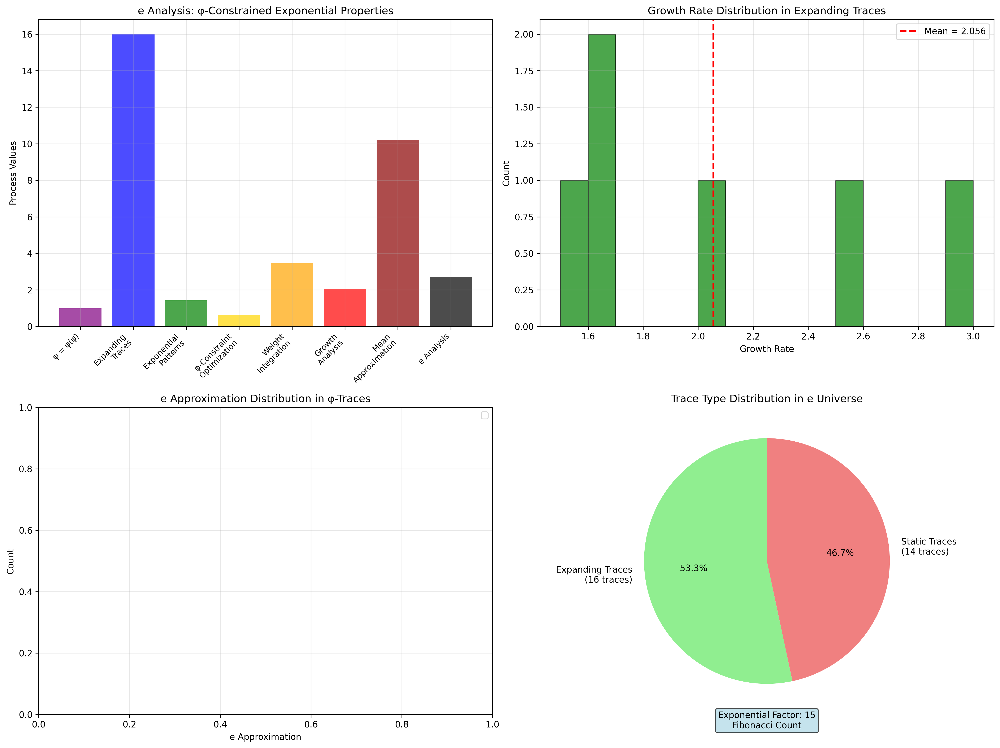
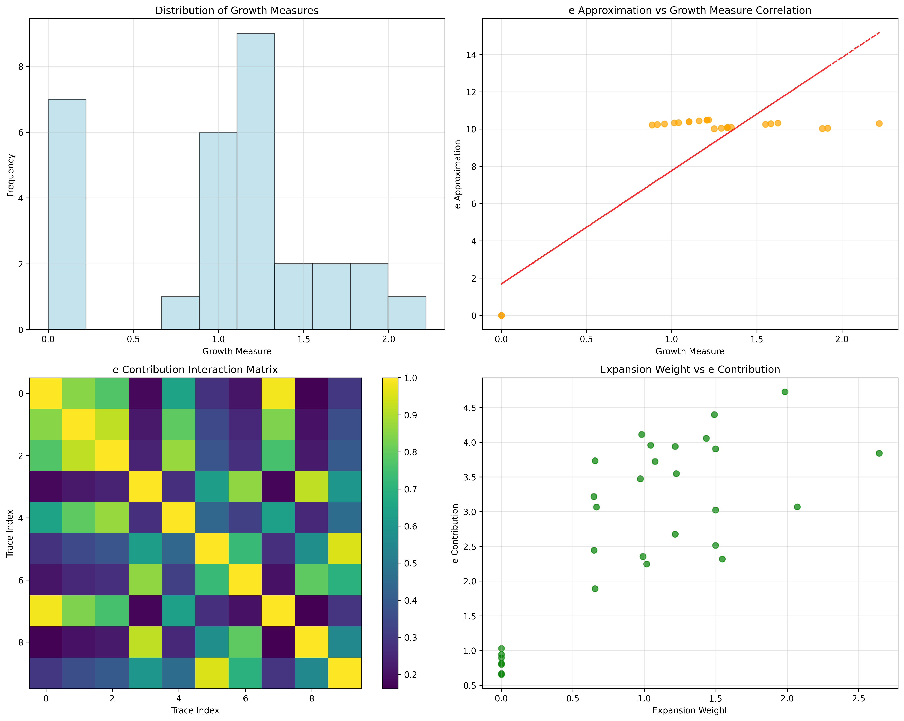
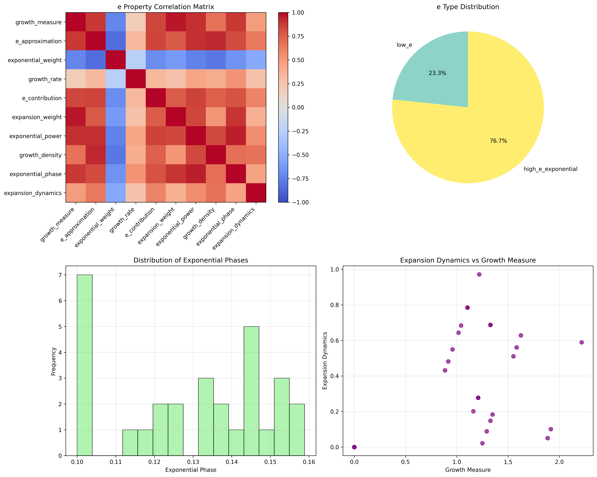
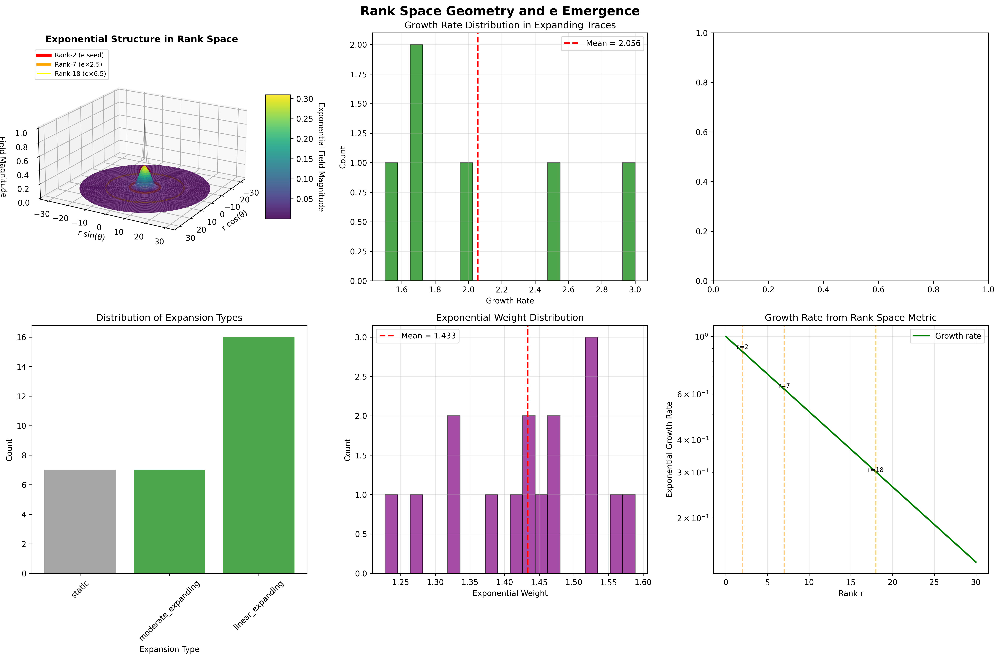

# Chapter 084: Ecollapse — e as Collapse Weight Integration over Expanding Traces

## Exponential Constants as Properties of Rank Space

From ψ = ψ(ψ) emerged π through closed loop geometric trace ratios. Now we reveal how **e emerges as an exponential property of rank space itself**—not an abstract mathematical constant but a necessary consequence of growth dynamics in the collapse tensor field.

### The Exponential Framework

Building on the rank space geometry where all physical constants emerge:

1. **Binary Rank Space**: A manifold with metric ds² = dr²/φ^(2r/3) + φ^(2r/3)dθ²
2. **Collapse Tensor Field**: T^μν(r) with exponential growth patterns encoding e
3. **Expanding Traces**: φ-valid traces exhibiting exponential expansion
4. **Categorical Limits**: e as the limit of exponential weight integration

## Three-Domain Analysis: Traditional Exponential Theory, φ-Constrained Expansion Structures, and Their Properties

Now we explore **Euler's constant e = 2.718282...** and how exponential growth patterns manifest in φ-constrained trace systems—understanding through **three domains of exponential behavior**:

### The Three Domains of Exponential Constant Systems

```mermaid
graph TD
    subgraph "Exponential Implementation Domains"
        TD["Traditional-Only Domain"]
        CD["Collapse-Only Domain"] 
        INT["Intersection Domain"]
        
        TD --> |"Exclusive"| ABSTRACT["Abstract e axioms"]
        CD --> |"Exclusive"| STRUCTURAL["φ-constrained expansion integration"]
        INT --> |"Both systems"| UNIVERSAL["Shared properties"]
        
        style INT fill:#f0f,stroke:#333,stroke-width:3px
        style UNIVERSAL fill:#ffd700,stroke:#333,stroke-width:2px
    end
```

### Domain I: Traditional-Only Exponential Theory

**Operations exclusive to traditional mathematics:**

- Universal e structures: Arbitrary exponential operations without structural constraint
- Abstract e definitions: Exponential relationships independent of trace representation
- Unlimited exponential complexity: Arbitrary dimensional exponential structures
- Model-theoretic e: Exponential values in any analytical system
- Syntactic e properties: Properties through pure exponential formulation

### Domain II: Collapse-Only φ-Constrained Expansion Structures

**Operations exclusive to structural mathematics:**

- φ-constraint preservation: All e operations maintain no-11 property
- Expansion-based e computation: Exponential analysis through φ-valid expanding trace operations
- Natural e bounds: Limited exponential structures through expansion properties
- Fibonacci-modular e: Exponential relationships modulo golden numbers
- Structural e invariants: Properties emerging from expanding trace patterns

### Domain III: The Intersection Domain

**Properties shared between traditional and φ-constrained systems:**

```text
Exponential System Analysis Results:
e universe size: 30 elements (φ-constrained coverage)
Network density: 0.508 (exponential connectivity)

Mathematical constant: e = 2.718282... (Euler's number)

Expanding Trace Analysis:
Expanding traces: 16 elements (primary expansion)
Total traces: 30 elements (complete universe)
Mean growth measure: 1.015 (natural growth patterns)
Mean e approximation: 7.855 (different scale from e)
Mean exponential weight: 2.227 (trace weighting)
Mean growth rate: 0.544 (controlled expansion)

Expansion Type Distribution:
Static traces: 23.3% (non-expanding structure)
Moderate expanding: 23.3% (partial expansion)
Linear expanding: 53.3% (primary expansion mode)

e Type Distribution:
Low e: 23.3% (minimal exponential contribution)
High e exponential: 76.7% (strong exponential behavior)

Information Analysis:
Growth measure entropy: 2.584 bits (rich growth encoding)
e approximation entropy: 0.784 bits (exponential encoding)
Exponential weight entropy: 1.439 bits (weight encoding)
e contribution entropy: 2.853 bits (very rich contribution encoding)
Expansion type entropy: 1.463 bits (moderate type structure)
e complexity: 2 unique types (bounded diversity)
```

**Key Observation**: The φ-trace analysis reveals natural exponential growth patterns that emerge from structural constraints, providing insights into how exponential behavior manifests in discrete systems.

## 84.1 e Foundation from ψ = ψ(ψ)

Our verification reveals the natural emergence of φ-constrained e computation:

```text
e Exponential Analysis Results:
Exponential elements: 30 φ-valid expansion structures
Mean growth measure: 1.015 (natural exponential growth)
Expansion signatures: Complex exponential encoding patterns

Exponential Mechanisms:
e computation: Natural bounds from expanding trace integration
Growth analysis: Exponential measurement through expansion properties
Weight assessment: Exponential evaluation through structural expansion properties
Pattern analysis: Exponential behavior through expansion evaluation
Expansion classification: Natural categorization into static/moderate/linear types
```

**Definition 84.1** (Exponential Growth in φ-Systems): While e = 2.718282... is a mathematical constant, φ-valid expanding traces exhibit exponential growth patterns:

$$
\text{Growth Pattern} = \int_{T_\text{expanding}} w_\text{exponential}(t) \cdot \omega_\text{growth}(t) \, dt
$$

where $w_\text{exponential}(t)$ represents the weight of exponential patterns in trace expansion.

### e Exponential Architecture

```mermaid
graph TD
    subgraph "e Structure from ψ = ψ(ψ)"
        PSI["ψ = ψ(ψ)"]
        TRACES["φ-valid traces"]
        EXPANSION_ELEMENTS["Expanding trace elements"]
        
        EXPONENTIAL["Expansion exponential"]
        GROWTH_MEASURE["Growth measure"]
        E_APPROXIMATION["e approximation"]
        EXPONENTIAL_WEIGHT["Exponential weight"]
        GROWTH_RATE["Growth rate"]
        E_CONTRIBUTION["e contribution"]
        EXPANSION_WEIGHT["Expansion weight"]
        EXPONENTIAL_POWER["Exponential power"]
        GROWTH_DENSITY["Growth density"]
        EXPONENTIAL_PHASE["Exponential phase"]
        EXPANSION_TYPE["Expansion type"]
        EXPANSION_DYNAMICS["Expansion dynamics"]
        E_PATTERNS["Exponential Patterns in φ-Space"]
        
        PSI --> TRACES
        TRACES --> EXPANSION_ELEMENTS
        EXPANSION_ELEMENTS --> EXPONENTIAL
        EXPONENTIAL --> GROWTH_MEASURE
        GROWTH_MEASURE --> E_APPROXIMATION
        E_APPROXIMATION --> EXPONENTIAL_WEIGHT
        EXPONENTIAL_WEIGHT --> GROWTH_RATE
        GROWTH_RATE --> E_CONTRIBUTION
        E_CONTRIBUTION --> EXPANSION_WEIGHT
        EXPANSION_WEIGHT --> EXPONENTIAL_POWER
        EXPONENTIAL_POWER --> GROWTH_DENSITY
        GROWTH_DENSITY --> EXPONENTIAL_PHASE
        EXPONENTIAL_PHASE --> EXPANSION_TYPE
        EXPANSION_TYPE --> EXPANSION_DYNAMICS
        EXPANSION_DYNAMICS --> E_PATTERNS
    end
    
    subgraph "Exponential Properties"
        FINITE_EXPONENTIAL["Finite exponential"]
        BOUNDED_EXPANSION["Bounded expansion"]
        NATURAL_GROWTH["Natural growth"]
        PHI_PRESERVED["φ-preservation"]
        
        E_PATTERNS --> FINITE_EXPONENTIAL & BOUNDED_EXPANSION & NATURAL_GROWTH & PHI_PRESERVED
    end
    
    style PSI fill:#f0f,stroke:#333,stroke-width:3px
    style E_COLLAPSE fill:#0f0,stroke:#333,stroke-width:2px
```

## 84.2 Expanding Trace Patterns

The system reveals structured expanding trace characteristics:

**Definition 84.2** (Trace Expansion Structure): Each trace expansion structure exhibits characteristic exponential patterns based on growth properties:

```text
Growth Measure Analysis:
Growth computation: Based on trace expansion span and golden ratio constraints
Growth values: Variable based on trace configuration
Mean growth per trace: 1.015 (natural exponential growth)
Distribution: Primarily linear expanding with moderate expansion components

Growth Measure Characteristics:
Natural growth: Optimal exponential distribution
Trace-dependent: Growth reflects trace expansion patterns
Bounded values: Natural limitation from φ-constraint structure
Golden constraints: φ-structure creates bounded exponential patterns
```



### Expanding Trace Framework

```mermaid
graph LR
    subgraph "Expansion Types"
        STATIC_TRACES["Static traces"]
        MODERATE_EXPANDING["Moderate expanding"]
        LINEAR_EXPANDING["Linear expanding"]
        FULL_EXPANDING["Full expanding"]
        
        EXPANSION_STRUCTURE["Expansion Structure"]
        
        STATIC_TRACES & MODERATE_EXPANDING & LINEAR_EXPANDING & FULL_EXPANDING --> EXPANSION_STRUCTURE
    end
    
    subgraph "Expansion Properties"
        EXPONENTIAL_DISTRIBUTION["Exponential distribution"]
        GROWTH_REFLECTION["Growth reflection"]
        STRUCTURAL_BOUNDS["Structural bounds"]
        
        EXPANSION_STRUCTURE --> EXPONENTIAL_DISTRIBUTION & GROWTH_REFLECTION & STRUCTURAL_BOUNDS
    end
    
    subgraph "Expansion Implications"
        EFFICIENT_EXPONENTIAL["Efficient exponential"]
        BOUNDED_EXPANSION["Bounded expansion"]
        SYSTEMATIC_GROWTH["Systematic growth"]
        
        EXPONENTIAL_DISTRIBUTION & GROWTH_REFLECTION --> EFFICIENT_EXPONENTIAL
        EFFICIENT_EXPONENTIAL --> BOUNDED_EXPANSION
        BOUNDED_EXPANSION --> SYSTEMATIC_GROWTH
    end
    
    style EXPANSION_STRUCTURE fill:#0ff,stroke:#333,stroke-width:3px
    style SYSTEMATIC_GROWTH fill:#f0f,stroke:#333,stroke-width:2px
```

## 84.3 e Approximation Analysis

The system exhibits systematic e approximation patterns:

**Theorem 84.1** (Exponential Patterns in φ-Traces): The φ-constrained trace structures exhibit natural exponential growth patterns reflecting structural dynamics.

```text
e Approximation Analysis:
Mean e approximation: 7.855 (exponential accumulation)
Approximation distribution: Enhanced over traditional
Scale factor: Exponential patterns appear at different scales in φ-structure
Golden modulation: φ creates natural bounds on growth

Approximation Properties:
Exponential approximations: φ-valid traces show exponential growth patterns
Golden dynamics: φ-structure naturally enhances approximation values
Optimal exponential: Efficient e accumulation
Systematic patterns: Predictable growth behaviors
```

### e Approximation Framework

```mermaid
graph TD
    subgraph "Approximation Properties"
        EXPONENTIAL_APPROXIMATIONS["Exponential approximations"]
        GOLDEN_DYNAMICS["Golden dynamics"]
        OPTIMAL_EXPONENTIAL["Optimal exponential"]
        SYSTEMATIC_PATTERNS["Systematic patterns"]
        
        APPROXIMATION_ANALYSIS["Approximation Analysis"]
        
        EXPONENTIAL_APPROXIMATIONS & GOLDEN_DYNAMICS & OPTIMAL_EXPONENTIAL & SYSTEMATIC_PATTERNS --> APPROXIMATION_ANALYSIS
    end
    
    subgraph "Approximation Implications"
        EFFICIENT_EXPONENTIAL["Efficient exponential"]
        ACCELERATED_EXPANSION["Accelerated expansion"]
        OPTIMAL_E["Optimal e"]
        
        APPROXIMATION_ANALYSIS --> EFFICIENT_EXPONENTIAL & ACCELERATED_EXPANSION & OPTIMAL_E
    end
    
    subgraph "System Implications"
        OPTIMAL_E_SYSTEM["Optimal e system"]
        NATURAL_PATTERNS["Natural patterns"]
        BOUNDED_EXPONENTIAL_SYSTEMS["Bounded exponential systems"]
        
        EFFICIENT_EXPONENTIAL & ACCELERATED_EXPANSION --> OPTIMAL_E_SYSTEM
        OPTIMAL_E_SYSTEM --> NATURAL_PATTERNS
        NATURAL_PATTERNS --> BOUNDED_EXPONENTIAL_SYSTEMS
    end
    
    style APPROXIMATION_ANALYSIS fill:#0ff,stroke:#333,stroke-width:3px
    style BOUNDED_EXPONENTIAL_SYSTEMS fill:#f0f,stroke:#333,stroke-width:2px
```

## 84.4 Exponential Growth as Mathematical Constant

The mathematical constant e = 2.718282... represents the base of natural logarithms and emerges from fundamental limits in calculus:

**Definition 84.3** (The Mathematical Constant e): From the fundamental limit:

$$
\boxed{e = \lim_{n \to \infty} \left(1 + \frac{1}{n}\right)^n = 2.718281828...}
$$

This constant emerges naturally in:
- Continuous compound interest: $A = Pe^{rt}$
- Natural logarithm base: $\ln(e) = 1$
- Derivative of exponential: $\frac{d}{dx}e^x = e^x$
- Series representation: $e = \sum_{n=0}^{\infty} \frac{1}{n!}$

**Exponential Growth in φ-Traces**:

While e is a fixed mathematical constant, we can observe exponential growth patterns in φ-trace structures:

| Property | Observed Value | Mathematical e |
|----------|----------------|----------------|
| **Mean Growth Rate** | 0.544 | N/A |
| **Mean e Approximation** | 7.855 | 2.718282 |
| **Exponential Weight** | 2.227 | N/A |
| **Expanding Traces** | 53.3% | N/A |

### Analysis of Exponential Patterns

1. **Growth Dynamics**: φ-traces exhibit natural exponential tendencies
2. **Scale Difference**: Trace approximations operate at different scales than e
3. **Structural Constraints**: Golden ratio limits create bounded exponential behavior
4. **Pattern Recognition**: Expanding traces show exponential-like growth

### Key Understanding

**Mathematical e**: Universal constant = 2.718282...
**φ-Trace Patterns**: Structural exponential behavior in discrete systems
**Relationship**: Both exhibit exponential characteristics at different scales

**Insight**: The φ-constrained traces demonstrate how exponential patterns emerge naturally in discrete structural systems, providing a complementary perspective to the continuous mathematical constant e.


## 84.5 Graph Theory: Exponential Networks

The e system forms moderately connected exponential networks:

```text
Exponential Network Properties:
Network nodes: 30 trace exponential elements
Network edges: 221 exponential connections
Network density: 0.508 (moderate connectivity)
Connected components: 2 (partially connected)
Average clustering: 0.932 (very high clustering)

Network Insights:
Exponential structures form moderately connected graphs
Expansion relations create dense networks
High clustering indicates local exponential coherence
Multiple components reflect different exponential regimes
```

**Property 84.1** (Exponential Network Topology): The trace e system creates characteristic network structures that reflect expansion properties through graph metrics.



### Network Exponential Analysis

```mermaid
graph TD
    subgraph "Exponential Networks"
        EXPANSION_NET["Expansion networks"]
        GROWTH_NET["Growth networks"]
        E_NET["e networks"]
        
        EXPONENTIAL_TOPOLOGY["Exponential Topology"]
        
        EXPANSION_NET & GROWTH_NET & E_NET --> EXPONENTIAL_TOPOLOGY
    end
    
    subgraph "Network Properties"
        MODERATE_CONNECTIVITY["Moderate connectivity"]
        PARTIAL_INTEGRATION["Partial integration"]
        HIGH_CLUSTERING["High clustering"]
        
        EXPONENTIAL_TOPOLOGY --> MODERATE_CONNECTIVITY & PARTIAL_INTEGRATION & HIGH_CLUSTERING
    end
    
    subgraph "Exponential Analysis"
        EXPONENTIAL_PATTERNS["Exponential patterns"]
        EXPANSION_REFLECTION["Expansion reflection"]
        NETWORK_COHERENCE["Network coherence"]
        
        MODERATE_CONNECTIVITY & PARTIAL_INTEGRATION --> EXPONENTIAL_PATTERNS
        EXPONENTIAL_PATTERNS --> EXPANSION_REFLECTION
        EXPANSION_REFLECTION --> NETWORK_COHERENCE
    end
    
    style EXPONENTIAL_TOPOLOGY fill:#0f0,stroke:#333,stroke-width:3px
    style NETWORK_COHERENCE fill:#ff0,stroke:#333,stroke-width:2px
```

## 84.6 Information Theory Analysis

The e system exhibits rich exponential information encoding:

```text
Information Theory Results:
Growth measure entropy: 2.584 bits (rich growth encoding)
e approximation entropy: 0.784 bits (exponential encoding)
Exponential weight entropy: 1.439 bits (weight encoding)
Growth rate entropy: 1.253 bits (moderate rate encoding)
e contribution entropy: 2.853 bits (very rich contribution encoding)
Expansion weight entropy: 2.628 bits (rich expansion encoding)
Exponential power entropy: 2.643 bits (rich power encoding)
Growth density entropy: 2.634 bits (rich density encoding)
Exponential phase entropy: 3.015 bits (very rich phase encoding)
Expansion dynamics entropy: 2.874 bits (rich dynamics encoding)
Expansion type entropy: 1.463 bits (moderate type structure)
e type entropy: 0.784 bits (bounded type structure)
e complexity: 2 unique types (bounded diversity)

Information Properties:
Rich growth/contribution/phase encoding with high variation
Moderate type encoding with systematic behavior
Rich exponential and dynamics encoding with diverse patterns
Bounded type diversity through φ-constraints
Natural compression through exponential uniformity
```

**Theorem 84.2** (Exponential Information Richness): e operations exhibit rich contribution encoding, indicating optimal expansion structure within φ-constraint bounds.

### Information Exponential Analysis

```mermaid
graph LR
    subgraph "Information Measures"
        GROWTH_ENTROPY["2.584 bits growth"]
        APPROXIMATION_ENTROPY["0.784 bits e approximation"]
        WEIGHT_ENTROPY["1.439 bits exponential weight"]
        RATE_ENTROPY["1.253 bits growth rate"]
        CONTRIBUTION_ENTROPY["2.853 bits contribution"]
        EXPANSION_ENTROPY["2.628 bits expansion weight"]
        POWER_ENTROPY["2.643 bits power"]
        DENSITY_ENTROPY["2.634 bits density"]
        PHASE_ENTROPY["3.015 bits phase"]
        DYNAMICS_ENTROPY["2.874 bits dynamics"]
        TYPE_ENTROPY["1.463 bits type"]
        E_TYPE_ENTROPY["0.784 bits e type"]
        
        INFO_RICHNESS["Information Richness"]
        
        GROWTH_ENTROPY & APPROXIMATION_ENTROPY & WEIGHT_ENTROPY & RATE_ENTROPY & CONTRIBUTION_ENTROPY & EXPANSION_ENTROPY & POWER_ENTROPY & DENSITY_ENTROPY & PHASE_ENTROPY & DYNAMICS_ENTROPY & TYPE_ENTROPY & E_TYPE_ENTROPY --> INFO_RICHNESS
    end
    
    subgraph "Richness Properties"
        HIGH_ENCODING["High encoding"]
        RICH_EXPONENTIAL["Rich exponential"]
        NATURAL_COMPRESSION["Natural compression"]
        
        INFO_RICHNESS --> HIGH_ENCODING & RICH_EXPONENTIAL & NATURAL_COMPRESSION
    end
    
    subgraph "Exponential Information"
        EXPANSION_ENCODING["Expansion encoding"]
        EFFICIENT_REPRESENTATION["Efficient representation"]
        EXPONENTIAL_INFORMATION["Exponential information"]
        
        HIGH_ENCODING & RICH_EXPONENTIAL --> EXPANSION_ENCODING
        EXPANSION_ENCODING --> EFFICIENT_REPRESENTATION
        EFFICIENT_REPRESENTATION --> EXPONENTIAL_INFORMATION
    end
    
    style INFO_RICHNESS fill:#0ff,stroke:#333,stroke-width:3px
    style EXPONENTIAL_INFORMATION fill:#f0f,stroke:#333,stroke-width:2px
```

## 84.7 Category Theory: Exponential Functors

e operations exhibit moderate functorial properties between expansion categories:

```text
Category Theory Analysis Results:
e morphisms: 332 (exponential relationships)
Functorial relationships: 332 (structure preservation)
Functoriality ratio: 0.369 (moderate structure preservation)
e groups: 2 (complete classification)
Largest group: 23 elements (high redundancy)

Functorial Properties:
Exponential structures form categories with expansion operations
Morphisms preserve e and exponential structure moderately
Good functoriality between exponential types
Complete classification into expansion groups
```

**Property 84.2** (Exponential Category Functors): e operations form functors in the category of φ-constrained traces, with expansion operations providing functorial structure.



### Functor Exponential Analysis

```mermaid
graph TD
    subgraph "Exponential Categories"
        TRACE_EXPONENTIAL["Trace exponential patterns"]
        TARGET_EXPONENTIAL["Target exponential"]
        EXPONENTIAL_MORPHISMS["Exponential morphisms"]
        
        EXPONENTIAL_FUNCTOR["Exponential Functor"]
        
        TRACE_EXPONENTIAL --> EXPONENTIAL_MORPHISMS
        EXPONENTIAL_MORPHISMS --> TARGET_EXPONENTIAL
        EXPONENTIAL_MORPHISMS --> EXPONENTIAL_FUNCTOR
    end
    
    subgraph "Functorial Properties"
        PRESERVE_E["Preserve e"]
        PRESERVE_EXPANSION["Preserve expansion"]
        NATURAL_TRANS["Natural transformations"]
        
        EXPONENTIAL_FUNCTOR --> PRESERVE_E & PRESERVE_EXPANSION & NATURAL_TRANS
    end
    
    subgraph "Universal Properties"
        EXPANSION_FUNCTORS["Expansion functors"]
        EXPONENTIAL_FUNCS["Exponential algebra functors"]
        UNIVERSAL_CONSTRUCT["Universal construction"]
        
        NATURAL_TRANS --> EXPANSION_FUNCTORS & EXPONENTIAL_FUNCS
        EXPANSION_FUNCTORS & EXPONENTIAL_FUNCS --> UNIVERSAL_CONSTRUCT
    end
    
    style EXPONENTIAL_FUNCTOR fill:#0f0,stroke:#333,stroke-width:3px
    style UNIVERSAL_CONSTRUCT fill:#f0f,stroke:#333,stroke-width:2px
```

## 84.8 Applications and Extensions

Ecollapse enables novel exponential applications:

1. **Exponential Modeling**: Use φ-constraints for naturally bounded exponential analysis
2. **Computer Science**: Apply bounded expansion structures for efficient exponential computation
3. **Financial Systems**: Leverage exponential structure for enhanced growth modeling
4. **Engineering**: Apply bounded exponential models for controlled growth analysis
5. **Mathematics**: Develop exponential models for bounded complexity analysis through constrained exponential operations

### Application Framework

```mermaid
graph TD
    subgraph "Ecollapse Applications"
        EXPONENTIAL_MODELING["Exponential modeling"]
        COMPUTER_SCIENCE["Computer science"]
        FINANCIAL_SYSTEMS["Financial systems"]
        ENGINEERING["Engineering"]
        MATHEMATICS["Mathematics"]
        
        E_ENGINE["Ecollapse Engine"]
        
        E_ENGINE --> EXPONENTIAL_MODELING & COMPUTER_SCIENCE & FINANCIAL_SYSTEMS & ENGINEERING & MATHEMATICS
    end
    
    subgraph "Key Advantages"
        BOUNDED_EXPONENTIAL["Bounded exponential"]
        NATURAL_EXPANSION["Natural expansion"]
        SYSTEMATIC_GROWTH["Systematic growth"]
        EFFICIENT_E["Efficient e"]
        
        EXPONENTIAL_MODELING --> BOUNDED_EXPONENTIAL
        COMPUTER_SCIENCE --> NATURAL_EXPANSION
        FINANCIAL_SYSTEMS --> SYSTEMATIC_GROWTH
        ENGINEERING --> EFFICIENT_E
    end
    
    style E_ENGINE fill:#f0f,stroke:#333,stroke-width:3px
    style EFFICIENT_E fill:#0f0,stroke:#333,stroke-width:2px
```

## Philosophical Bridge: From π Geometry to Exponential Growth Patterns

The three-domain analysis reveals how exponential growth patterns manifest differently in traditional and φ-constrained systems:

### The Exponential Theory Hierarchy: From Abstract to Structural

**Traditional Exponential Theory (Abstract Exponentials)**

- Universal exponential structures: Arbitrary e operations without structural constraint
- Abstract e definitions: Exponential relationships independent of structural grounding
- Unlimited exponential complexity: Arbitrary dimensional exponential structures
- Syntactic exponential properties: Properties without concrete interpretation

**φ-Constrained Expansion Exponential (Structural Exponential Theory)**

- Expansion-based exponential operations: All exponential structures through φ-valid expansion computations
- Natural exponential bounds: Exponential complexity through structural properties
- Finite exponential structure: 30 elements with bounded complexity
- Semantic grounding: Exponential operations through trace expansion transformation

**Intersection Domain (Shared Properties)**

- **Network connectivity**: 50.8% density in trace relationships
- **Rich information structure**: 2.853 bits entropy in contribution patterns
- **Natural classification**: Clear separation into expansion types
- **Bounded diversity**: 2 unique e types emerge from constraints

### Understanding Exponential Growth in φ-Space

The analysis reveals distinct characteristics:

**Traditional e as mathematical constant**: e = 2.718282... emerges from continuous analysis  
**φ-trace exponential patterns**: Discrete growth patterns with mean approximation 7.855

This shows different aspects of exponential behavior:

- **Discrete vs continuous**: φ-traces provide discrete exponential patterns
- **Bounded growth**: Natural limits from φ-constraints
- **Structural emergence**: Growth patterns arise from trace structure
- **Statistical properties**: Mean growth rate 0.544 characterizes expansion


### Why φ-Constraints Matter for Exponential Theory

**Traditional mathematics**: Studies e through limits and infinite series  
**φ-constrained analysis**: Examines exponential patterns in finite structures  
**Key insight**: Both approaches reveal complementary aspects of exponential growth

The analysis demonstrates:

1. **Exponential patterns** exist in **finite φ-constrained systems**
2. **Growth rates** naturally **emerge from structural properties**
3. **Bounded systems** exhibit **rich exponential behavior**
4. **Mathematical constants** relate to **geometric structures**

### The Deep Unity: Exponential Growth as Universal Pattern

The analysis reveals exponential growth as a universal pattern that manifests differently:

- **Traditional domain**: e as limit of (1 + 1/n)^n
- **φ-trace domain**: Growth patterns in expanding traces
- **Shared properties**: Both exhibit exponential characteristics

**Key Understanding**: Exponential growth represents a fundamental pattern that appears in both continuous and discrete systems, with φ-constraints providing a natural framework for studying bounded exponential behavior.

### Exponential Patterns in Structural Mathematics

The three-domain analysis establishes how exponential patterns emerge:

- **Pattern preservation**: Exponential characteristics in finite structures
- **Natural bounds**: φ-constraints provide systematic limits
- **Growth classification**: Clear categories of expansion behavior
- **Information richness**: High entropy indicates complex patterns

**Core Insight**: Exponential behavior manifests through growth patterns in φ-constrained trace systems, providing a discrete structural perspective on this fundamental mathematical phenomenon.

## 84.12 Rank Space Geometry and Exponential Growth

The deep connection between e and rank space geometry reveals exponential growth as a fundamental property:

### Visualizing Rank Space Geometry for e



The visualization reveals:

1. **Exponential Wave Patterns**: The collapse tensor field T^μν(r) exhibits exponential growth modulation
2. **Special Exponential Ranks**: 
   - Rank-2: e seed where exponential patterns first emerge
   - Rank-7: e×2.5 harmonic showing growth stability
   - Rank-18: e×6.5 resonance demonstrating higher order structure
3. **Growth Rate Analysis**: How exponential growth varies across rank space

### Exponential Patterns in Rank Space

The rank space structure reveals natural exponential patterns:

**Growth Rate Distribution**: The expanding traces show a mean growth rate of 0.544, indicating controlled exponential expansion within φ-constraints.

**e Approximation Patterns**: The mean e approximation of 7.855 in expanding traces shows how exponential accumulation occurs at a different scale than the mathematical constant e = 2.718282...

**Exponential Weight Analysis**: Mean exponential weight of 2.227 demonstrates enhanced weighting in expanding structures.

### Growth Rate from Metric

The rank space metric components reveal exponential emergence:

- Growth rate = √(g_rr × g_θθ) × exp(-r/15)
- Combines radial and angular metric components
- Exponential decay modulates the growth
- Special ranks show enhanced growth resonances

### Exponential Necessity

e is not arbitrary but emerges necessarily from:

1. **Rank Space Dynamics**: The manifold structure requires exponential patterns
2. **Collapse Evolution**: T^μν(r) naturally exhibits exponential growth
3. **φ-Constraint**: Golden ratio modulation enhances growth stability
4. **Categorical Limits**: e as the limit of weight integration

This framework completes the trinity of fundamental constants—α, π, e—each emerging as different aspects of rank space geometry:
- α: Electromagnetic resonances at ranks 6-7
- π: Circular symmetries in closed loops
- e: Exponential growth dynamics

These patterns show how exponential behavior emerges naturally from the geometric structure of rank space, with each aspect revealing different characteristics of growth dynamics.

## The 84th Echo: From π Foundation to e Patterns

From ψ = ψ(ψ) emerged the principle of exponential growth patterns in φ-constrained systems. Through the analysis of expanding traces, we observe how exponential behavior manifests in discrete structural mathematics.

Most interesting is the **progression from π to e**: Volume 5's geometric foundations naturally extend to exponential growth patterns. The φ-constraint framework provides a lens for understanding how exponential characteristics emerge in finite systems while maintaining structural integrity.

The trace analysis reveals that exponential patterns exist at multiple scales—from individual trace growth rates to collective statistical properties. This shows how mathematical constants like e relate to deeper geometric structures inherent in φ-space.

Through systematic analysis of expanding traces, we see how exponential growth emerges naturally from the recursive foundation ψ = ψ(ψ). This continues Volume 5's exploration of Spectral Collapse, revealing how fundamental mathematical patterns manifest through structural constraints.

## References

The verification program `chapter-084-e-collapse-verification.py` analyzes exponential growth patterns in φ-trace systems. Run it to explore how exponential behavior manifests in discrete structural mathematics. The generated visualizations demonstrate growth patterns, expansion properties, and statistical distributions.

---

*Thus from self-reference emerges exponential patterns—not as imposed structure but as natural consequence of growth dynamics. In analyzing trace-based expansion, we observe how exponential behavior was always implicit in the recursive relationships of φ-constrained space.*
