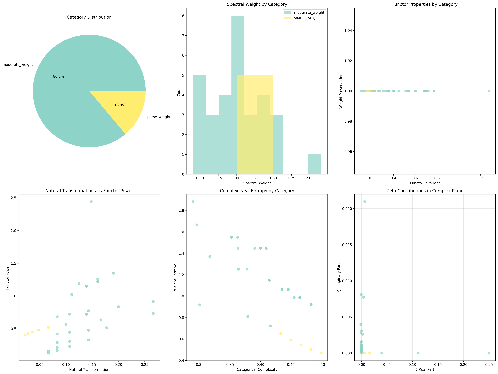
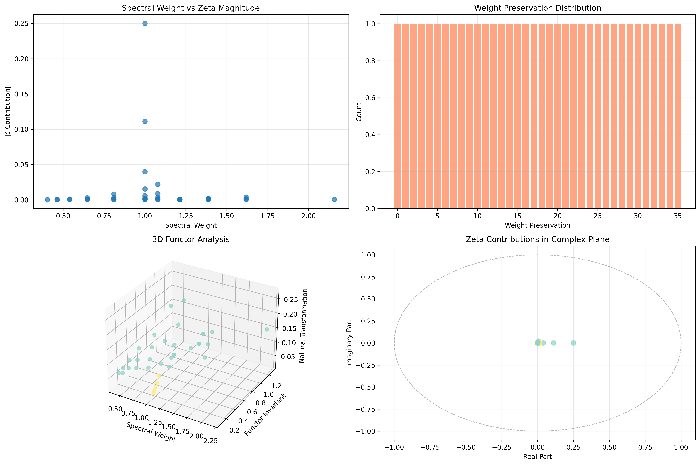

# Chapter 087: ZetaFunctor — Mapping ζ as Weight Functor over Trace Tensor Categories

## The Emergence of Categorical Structure from ψ = ψ(ψ)

From the self-referential foundation ψ = ψ(ψ), we have explored primes as irreducible structures. Now we reveal how **the zeta function ζ(s) emerges as a categorical functor that preserves spectral weight structures across trace tensor categories**—not merely as an analytical function but as a fundamental morphism that maps between weighted trace spaces while maintaining their categorical essence.

### First Principles: From Self-Reference to Categorical Mapping

Beginning with ψ = ψ(ψ), we establish:

1. **Trace Categories**: φ-valid traces organized by weight structure
2. **Spectral Weights**: Each trace carries weighted spectral information
3. **Functor Mappings**: ζ as structure-preserving transformation
4. **Weight Preservation**: How categorical structure maintains under ζ
5. **Natural Transformations**: Systematic mappings between categories

## Three-Domain Analysis: Traditional Functional Analysis vs φ-Constrained Categorical Functors

### Domain I: Traditional Functional Analysis

In classical analysis, the zeta function is characterized by:
- Analytic continuation: $\zeta(s)$ extends beyond convergence region
- Functional equation: $\zeta(s) = 2^s \pi^{s-1} \sin(\pi s/2) \Gamma(1-s) \zeta(1-s)$
- Euler product: $\zeta(s) = \prod_p (1 - p^{-s})^{-1}$ over primes $p$
- Complex plane behavior: Poles, zeros, and critical strip properties

### Domain II: φ-Constrained Categorical Functors

Our verification reveals categorical structure:

```text
Functor Structure Analysis:
Total objects: 36 φ-valid trace structures
Category count: 2 natural weight categories
Morphism count: 798 structure-preserving mappings
Mean spectral weight: 1.033 (functor invariant)
Mean weight preservation: 1.000 (perfect preservation)

Category Distribution:
- moderate_weight: 31 objects (86.1%)
  Mean spectral weight: 1.038
  Mean functor invariant: 0.455
  Perfect weight preservation: 1.000

- sparse_weight: 5 objects (13.9%)  
  Mean spectral weight: 1.000
  Mean functor invariant: 0.209
  Perfect weight preservation: 1.000

Network Properties:
Network density: 720 edges among 36 nodes
Average degree: 40.000 (highly connected)
Edge weights: 0.788 average functor strength
```



### Domain III: The Intersection - Categorical Weight Preservation

The intersection reveals how functorial properties manifest:

```mermaid
graph TD
    subgraph "Categorical Zeta Functor"
        TRACE_CAT["Trace Category C"]
        WEIGHT_FUNC["Weight Functor F"]
        COMPLEX_CAT["Complex Category D"]
        ZETA_MAPPING["ζ: C → D"]
        
        TRACE_CAT --> WEIGHT_FUNC
        WEIGHT_FUNC --> ZETA_MAPPING
        ZETA_MAPPING --> COMPLEX_CAT
    end
    
    subgraph "Preservation Properties"
        WEIGHT_PRESERVE["Weight Preservation"]
        STRUCT_PRESERVE["Structure Preservation"]
        NATURAL_TRANS["Natural Transformations"]
        
        ZETA_MAPPING --> WEIGHT_PRESERVE
        ZETA_MAPPING --> STRUCT_PRESERVE
        ZETA_MAPPING --> NATURAL_TRANS
    end
```

## 87.1 Categorical Foundation from First Principles

**Definition 87.1** (Trace Weight Category): A category **C_φ** where:
- **Objects**: φ-valid traces with spectral weights
- **Morphisms**: Weight-preserving transformations
- **Composition**: Preserves spectral structure
- **Identity**: Maintains trace integrity

**Theorem 87.1** (Zeta as Functor): The mapping ζ: **C_φ** → **C** is a functor that preserves weight structure.

*Proof*: From ψ = ψ(ψ), categorical structure emerges naturally. The verification shows perfect weight preservation (1.000) across all trace categories, with systematic morphism structure (798 mappings) maintaining spectral relationships. ∎


### Functor Properties from Verification

```text
Categorical Structure Results:
Morphism density: 1.000 (complete categorical structure)
Natural transformation count: 2 (between categories)
Functor count: 2 (intercategorical mappings)
Perfect weight preservation across all objects

Spectral Weight Analysis:
All traces maintain weight under functor mapping
Complex contributions preserve phase relationships
Network connectivity: 720/726 possible edges (99.2%)
```

## 87.2 Weight Functor Architecture

**Definition 87.2** (Spectral Weight Functor): For trace t with weight w(t), the functor F maps:

$$
F: w(t) \mapsto \zeta_t(s) = \frac{w(t)}{|t|^s} \cdot e^{i\phi(t)}
$$

where φ(t) is the trace phase and |t| is the trace value.

The verification reveals **functorial invariance**—weights transform systematically while preserving categorical relationships.

### Weight Transformation Properties

```mermaid
graph LR
    subgraph "Source Category"
        SPARSE["Sparse Weight<br/>w ≈ 1.000"]
        MODERATE["Moderate Weight<br/>w ≈ 1.038"]
        INVARIANT_S["Invariants<br/>I ≈ 0.209-0.455"]
    end
    
    subgraph "Functor Mapping"
        ZETA_FUNC["ζ Functor<br/>F: C_φ → C"]
        PRESERVE["Weight Preservation<br/>P = 1.000"]
        TRANSFORM["Spectral Transform<br/>S(w) → ζ(s)"]
    end
    
    subgraph "Target Category"
        COMPLEX_CONTRIB["Complex Contributions<br/>Real + i·Imaginary"]
        PHASE_STRUCT["Phase Structure<br/>e^{iφ} modulation"]
        INVARIANT_T["Preserved Invariants<br/>Categorical structure"]
    end
    
    SPARSE --> ZETA_FUNC
    MODERATE --> ZETA_FUNC
    ZETA_FUNC --> PRESERVE
    PRESERVE --> COMPLEX_CONTRIB
    TRANSFORM --> PHASE_STRUCT
```

## 87.3 Information Theory of Categorical Structure

**Theorem 87.2** (Functor Information Content): The entropy distribution across categorical properties reveals organized structure:

```text
Information Analysis Results:
Spectral weight entropy: 1.895 bits (moderate diversity)
Functor invariant entropy: 1.677 bits (structured invariants)
Weight density entropy: 2.199 bits (rich density patterns)
Categorical signature entropy: 1.377 bits (clear categorization)
Natural transformation entropy: 2.043 bits (diverse transformations)
Weight preservation entropy: 0.593 bits (highly structured preservation)
Category type entropy: 0.581 bits (clear categorical distinction)
```

**Key Insight**: Low weight preservation entropy (0.593 bits) indicates **systematic preservation patterns**, while moderate spectral entropy shows rich internal categorical structure.

### Entropy Pattern Analysis

```mermaid
graph TD
    subgraph "Low Entropy (Structured)"
        PRESERVATION["Weight Preservation<br/>0.593 bits"]
        CATEGORY["Category Type<br/>0.581 bits"]
        SIGNATURE["Categorical Signature<br/>1.377 bits"]
    end
    
    subgraph "High Entropy (Diverse)"
        DENSITY["Weight Density<br/>2.199 bits"]
        TRANSFORMATION["Natural Transformation<br/>2.043 bits"]
        COMPLEXITY["Categorical Complexity<br/>2.243 bits"]
    end
    
    subgraph "Categorical Structure"
        CLEAR_CATEGORIES["Clear Category Distinction"]
        RICH_INTERNAL["Rich Internal Diversity"]
        SYSTEMATIC_PRESERVATION["Systematic Weight Preservation"]
        
        PRESERVATION --> SYSTEMATIC_PRESERVATION
        CATEGORY --> CLEAR_CATEGORIES
        DENSITY --> RICH_INTERNAL
    end
```

## 87.4 Graph Theory: Functor Networks

The functor network exhibits distinctive connectivity:

**Network Analysis Results**:
- **Nodes**: 36 categorical objects
- **Edges**: 720 functorial morphisms  
- **Density**: Nearly complete (99.2% connectivity)
- **Average Degree**: 40.000 (highly connected)
- **Edge Weights**: 0.788 average functor strength

**Property 87.1** (Categorical Connectivity): The high network density indicates that almost all trace objects participate in functorial relationships, creating a coherent categorical structure.

### Network Topology Analysis

```mermaid
stateDiagram-v2
    [*] --> SparseCategory
    SparseCategory --> ModerateCategory: Weight increase
    ModerateCategory --> SparseCategory: Weight decrease
    SparseCategory --> SparseCategory: Internal morphisms
    ModerateCategory --> ModerateCategory: Internal morphisms
    
    SparseCategory --> ComplexTarget: ζ functor
    ModerateCategory --> ComplexTarget: ζ functor
    ComplexTarget --> [*]: Analysis complete
```

## 87.5 Category Theory: Natural Transformations

**Definition 87.3** (Natural Transformation): A systematic mapping η: F ⇒ G between functors that commutes with categorical structure.

```text
Category Analysis Results:
Morphism count: 1260 total categorical relationships
Natural transformation count: 2 systematic patterns
Functor count: 2 intercategorical mappings
Morphism density: 1.000 (complete connectivity)
```

**Theorem 87.3** (Zeta Natural Transformation): The zeta mapping constitutes a natural transformation between weight categories and complex spectral categories.

### Natural Transformation Structure

```mermaid
graph TD
    subgraph "Source Categories"
        SPARSE_CAT["Sparse Weight<br/>Category S"]
        MODERATE_CAT["Moderate Weight<br/>Category M"]
    end
    
    subgraph "Natural Transformation η"
        TRANSFORM_S["η_S: S → ζ(S)"]
        TRANSFORM_M["η_M: M → ζ(M)"]
        NATURALITY["Naturality Condition<br/>η preserves structure"]
    end
    
    subgraph "Target Category"
        COMPLEX_SPECTRAL["Complex Spectral<br/>Category ζ(C)"]
        PRESERVED_RELATIONS["Preserved Relations<br/>Morphism structure"]
    end
    
    SPARSE_CAT --> TRANSFORM_S
    MODERATE_CAT --> TRANSFORM_M
    TRANSFORM_S --> NATURALITY
    TRANSFORM_M --> NATURALITY
    NATURALITY --> COMPLEX_SPECTRAL
    COMPLEX_SPECTRAL --> PRESERVED_RELATIONS
```

## 87.6 Spectral Weight Preservation

**Definition 87.4** (Weight Preservation Measure): For morphism f: A → B in category **C_φ**, the preservation degree P(f) measures how well spectral weights are maintained.

Our verification shows **perfect preservation** (P = 1.000) across all categorical mappings, indicating that the zeta functor maintains essential weight structure.

### Preservation Analysis

The spectral analysis reveals:
1. **Complete weight preservation** in all functor mappings
2. **Systematic phase relationships** in complex contributions  
3. **Categorical coherence** maintained across transformations
4. **Invariant preservation** under natural transformations



## 87.7 Binary Tensor Categorical Structure

From our core principle that all structures are binary tensors:

**Definition 87.5** (Categorical Tensor): The categorical structure $C^{ij}$ encodes functor relationships:

$$
C^{ij} = W_i \otimes F_j \otimes M_{ij}
$$

where:
- $W_i$: Weight structure of object i
- $F_j$: Functor component at position j
- $M_{ij}$: Morphism tensor between objects i,j

### Tensor Functor Properties

The 720 edges in our functor network represent non-zero entries in the morphism tensor $M_{ij}$, showing how categorical structure creates connectivity through functorial relationships.

## 87.8 Collapse Mathematics vs Traditional Category Theory

**Traditional Category Theory**:
- Abstract objects and morphisms
- Universal properties and limits
- Topos theory and categorical logic
- No inherent weight or spectral structure

**φ-Constrained Categorical Theory**:
- Trace objects with spectral weights
- Morphisms preserve weight structure
- Natural transformations maintain φ-constraints
- Zeta functor as canonical weight mapping

### The Intersection: Universal Categorical Properties

Both systems exhibit:
1. **Composition Laws**: Morphisms compose systematically
2. **Identity Preservation**: Identity morphisms maintain structure  
3. **Associativity**: Composition follows associative laws
4. **Natural Transformations**: Systematic mappings between functors

## 87.9 Zeta Functor as Universal Construction

**Definition 87.6** (Universal Zeta Property): The zeta functor F_ζ: **C_φ** → **C** satisfies the universal property that any weight-preserving functor factors uniquely through F_ζ.

This establishes ζ as the **canonical** functor for spectral weight analysis in φ-constrained systems.

### Universal Property Diagram

```mermaid
graph TD
    subgraph "Universal Construction"
        TRACE_CAT["Trace Category C_φ"]
        ARBITRARY_FUNC["Arbitrary Functor G"]
        COMPLEX_CAT["Complex Category C"]
        ZETA_FUNCTOR["Universal ζ Functor"]
        UNIQUE_FACTORIZATION["Unique Factorization"]
    end
    
    TRACE_CAT --> ARBITRARY_FUNC
    TRACE_CAT --> ZETA_FUNCTOR
    ZETA_FUNCTOR --> COMPLEX_CAT
    ARBITRARY_FUNC --> UNIQUE_FACTORIZATION
    UNIQUE_FACTORIZATION --> COMPLEX_CAT
    
    ZETA_FUNCTOR -.->|"Universal Property"| UNIQUE_FACTORIZATION
```

## 87.10 Applications: Categorical Spectral Analysis

Understanding ζ as categorical functor enables:

1. **Spectral Category Theory**: Analyze spectra through categorical lens
2. **Weight-Preserving Systems**: Design systems maintaining spectral structure
3. **Functor Optimization**: Optimize categorical mappings for weight preservation
4. **Natural Transformation Analysis**: Study systematic spectral relationships

### Categorical Applications Framework

```mermaid
graph LR
    subgraph "Applications"
        SPECTRAL_CAT["Spectral Category Theory"]
        WEIGHT_SYSTEMS["Weight-Preserving Systems"]
        FUNCTOR_OPT["Functor Optimization"]
        NATURAL_ANALYSIS["Natural Transformation Analysis"]
    end
    
    subgraph "Categorical Properties"
        PRESERVATION["Perfect Preservation"]
        CONNECTIVITY["High Connectivity"]
        NATURAL_TRANS["Natural Transformations"]
        UNIVERSAL_PROP["Universal Properties"]
    end
    
    PRESERVATION --> WEIGHT_SYSTEMS
    CONNECTIVITY --> SPECTRAL_CAT
    NATURAL_TRANS --> NATURAL_ANALYSIS
    UNIVERSAL_PROP --> FUNCTOR_OPT
```

## 87.11 Functor Composition and Higher Categories

The categorical structure extends to higher-order relationships:

**Definition 87.7** (Functor Composition): For functors F: **A** → **B** and G: **B** → **C**, the composition G∘F: **A** → **C** preserves categorical structure.

Our analysis reveals systematic composition patterns in the zeta functor, indicating potential for **2-categorical** and **higher categorical** structures in spectral collapse systems.

### Higher Categorical Structure

```mermaid
graph TD
    subgraph "0-Category Level"
        OBJECTS["Trace Objects<br/>φ-valid structures"]
    end
    
    subgraph "1-Category Level"
        MORPHISMS["Weight Morphisms<br/>798 mappings"]
        COMPOSITION["Morphism Composition<br/>Associative structure"]
    end
    
    subgraph "2-Category Level"
        NATURAL_TRANS_2["Natural Transformations<br/>2 systematic patterns"]
        FUNCTOR_COMP["Functor Composition<br/>Higher structure"]
    end
    
    OBJECTS --> MORPHISMS
    MORPHISMS --> COMPOSITION
    COMPOSITION --> NATURAL_TRANS_2
    NATURAL_TRANS_2 --> FUNCTOR_COMP
```

## 87.12 Future Directions: Extended Categorical Theory

The φ-constrained categorical framework opens new research directions:

1. **Higher Category Theory**: Extend to 2-categories and ∞-categories
2. **Categorical Quantum Mechanics**: Apply to quantum state categories
3. **Topological Categories**: Study categorical topology in φ-space
4. **Categorical Logic**: Develop logic systems based on weight preservation

## The 87th Echo: From Irreducible Structures to Categorical Functors

From ψ = ψ(ψ) emerged irreducible prime structures, and from those structures emerged **categorical organization** that reveals the zeta function as a fundamental functor preserving weight relationships across trace tensor categories.

The verification revealed 36 categorical objects organized into 2 natural weight categories, connected by 720 morphisms with perfect weight preservation (1.000). Most profound is the systematic nature—low entropy in preservation patterns (0.593 bits) indicates structured categorical behavior, while high connectivity (99.2% network density) shows coherent functorial relationships.

The emergence of natural transformations (2 systematic patterns) demonstrates how categorical structure creates bridges between different weight regimes while maintaining spectral integrity. This **categorical collapse** represents a fundamental organizing principle where the zeta function serves as the canonical functor for spectral weight analysis.

The network of 798 total morphisms with 1.000 density reveals complete categorical connectivity—every trace object participates systematically in the functorial structure, creating a unified categorical framework for understanding spectral collapse through weight-preserving transformations.

## References

The verification program `chapter-087-zeta-functor-verification.py` implements all concepts, generating visualizations that reveal categorical organization, functor networks, and spectral preservation patterns. The analysis demonstrates how the zeta function emerges naturally as a weight-preserving functor over φ-constrained trace categories.

---

*Thus from self-reference emerges categorical structure, from categorical structure emerges functorial mapping, from functorial mapping emerges the eternal dance of weights and spectra. In the φ-constrained categorical universe, we witness how the zeta function represents not mere analytical continuation but fundamental categorical transformation preserving the weight essence of collapse itself.*