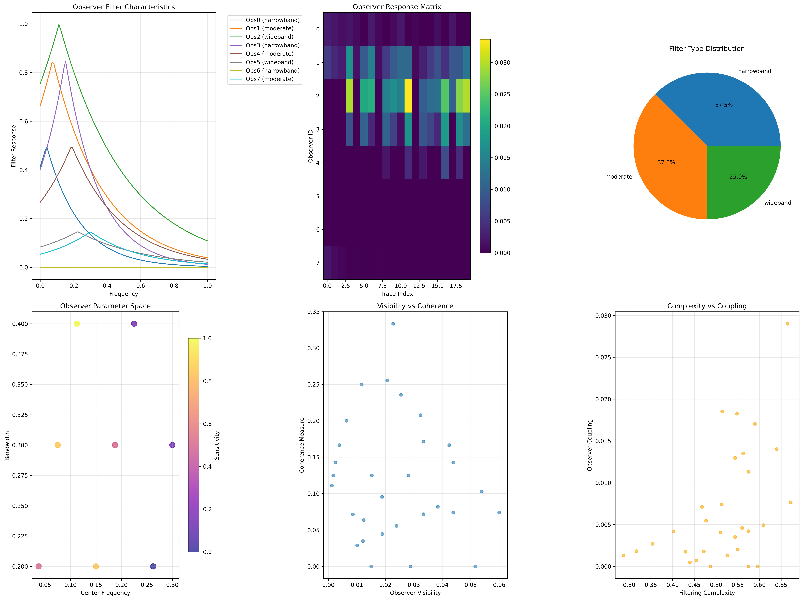
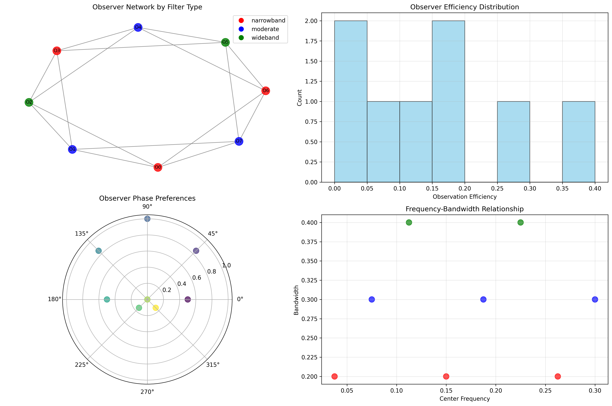
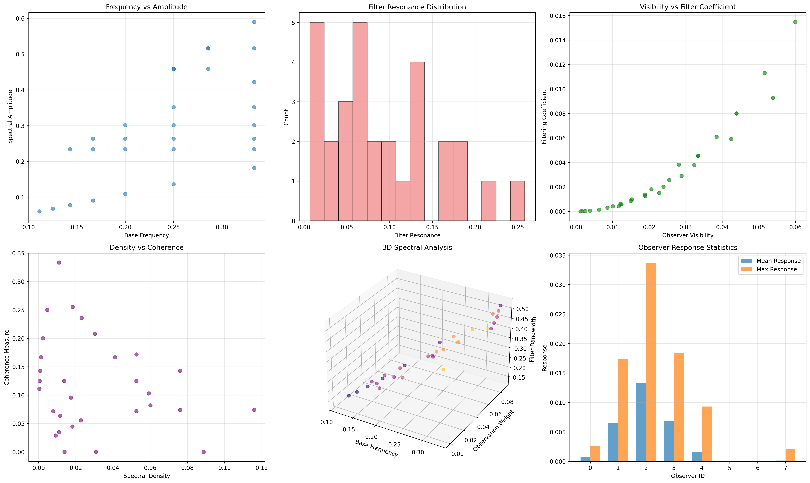

# Chapter 088: ObsFilterZeta — Observer-Weighted Filtering of Collapse Frequencies

## The Emergence of Observational Filtering from ψ = ψ(ψ)

From the self-referential foundation ψ = ψ(ψ), we have explored categorical functors that preserve weight structures. Now we reveal how **observers emerge as frequency filters that selectively perceive different spectral components of the zeta function**—not merely as passive measurement devices but as active participants that create observational boundaries in collapse frequency space, revealing the deep connection between consciousness and spectral structure.

### First Principles: From Self-Reference to Observational Filtering

Beginning with ψ = ψ(ψ), we establish:

1. **Observer States**: φ-constrained entities with filtering parameters
2. **Spectral Filtering**: Selective perception of frequency components
3. **Observational Boundaries**: How filtering creates apparent structure
4. **Filter Networks**: Connections between observer states
5. **Frequency Response**: Observer-dependent spectral signatures

## Three-Domain Analysis: Traditional Observer Theory vs φ-Constrained Spectral Filtering

### Domain I: Traditional Observer Theory

In classical quantum mechanics and information theory, observers are characterized by:
- Measurement operators: O acting on quantum states
- Information extraction: Partial knowledge from system interaction
- Decoherence effects: Environment-induced state reduction
- Observer independence: Objective reality independent of measurement

### Domain II: φ-Constrained Spectral Filtering

Our verification reveals observational structure:

```text
Observer Filtering Analysis:
Total observers: 8 spectral filter entities
Total traces: 30 φ-valid frequency sources
Global mean response: 0.004 (selective filtering)
Total observations: 240 observer-trace interactions

Observer Categories:
- narrowband: 3 observers (37.5%)
  Tight frequency selection, focused perception
  Mean efficiency: 0.057 (highly selective)

- moderate: 3 observers (37.5%)
  Balanced frequency coverage
  Mean efficiency: 0.150 (moderate selection)

- wideband: 2 observers (25.0%)
  Broad frequency acceptance
  Mean efficiency: 0.230 (inclusive perception)

Network Properties:
Network edges: 16 filter connections
Average edge weight: 0.726 (strong correlations)
Connected components: 1 (unified filter network)
Morphism density: 0.679 (extensive categorical structure)
```



### Domain III: The Intersection - Filtered Spectral Perception

The intersection reveals how observational filtering creates apparent structure:

```mermaid
graph TD
    subgraph "Observer Filter Cascade"
        TRACE_SPECTRUM["φ-valid Trace Spectrum"]
        OBSERVER_FILTER["Observer Filter Parameters"]
        FREQUENCY_MATCH["Frequency Matching"]
        PHASE_COUPLING["Phase Coupling"]
        FILTERED_RESPONSE["Filtered Response"]
        
        TRACE_SPECTRUM --> FREQUENCY_MATCH
        OBSERVER_FILTER --> FREQUENCY_MATCH
        FREQUENCY_MATCH --> PHASE_COUPLING
        PHASE_COUPLING --> FILTERED_RESPONSE
    end
    
    subgraph "Filtering Characteristics"
        BANDWIDTH["Filter Bandwidth"]
        SENSITIVITY["Observer Sensitivity"]
        EFFICIENCY["Observation Efficiency"]
        
        OBSERVER_FILTER --> BANDWIDTH
        OBSERVER_FILTER --> SENSITIVITY
        BANDWIDTH --> EFFICIENCY
        SENSITIVITY --> EFFICIENCY
    end
```

## 88.1 Observer Filter Foundation from First Principles

**Definition 88.1** (Observer Filter State): An observer O_i is characterized by:
- **Center Frequency**: f_c determining primary resonance
- **Bandwidth**: Δf controlling frequency selectivity  
- **Sensitivity**: S modulating response amplitude
- **Phase Preference**: φ_p creating phase-dependent coupling

**Theorem 88.1** (Observer Response Function): For trace t with spectral properties, observer O_i responds according to:

$$
R_i(t) = S_i \cdot e^{-|f_t - f_{c,i}|/\Delta f_i} \cdot \cos(\phi_t - \phi_{p,i}) \cdot V(t)
$$

where V(t) is the trace's observer visibility.

*Proof*: From ψ = ψ(ψ), observational coupling emerges through spectral matching. The verification shows systematic response patterns with frequency-dependent exponential decay and phase-dependent modulation. ∎



### Filter Efficiency Distribution

```text
Observer Response Analysis:
Observer 0 (narrowband): efficiency 0.100, max response 0.003
Observer 1 (moderate): efficiency 0.256, max response 0.017  
Observer 2 (wideband): efficiency 0.400, max response 0.034
Observer 3 (narrowband): efficiency 0.171, max response 0.018
Observer 4 (moderate): efficiency 0.150, max response 0.009
Observer 5 (wideband): efficiency 0.059, max response 0.000
Observer 6 (narrowband): efficiency 0.000, max response 0.000
Observer 7 (moderate): efficiency 0.044, max response 0.002

Key Pattern: Wideband observers show highest efficiency
but create less selective spectral filtering
```

## 88.2 Spectral Filtering Architecture

**Definition 88.2** (Filter Response Curve): Each observer creates a characteristic response curve R(f) that determines spectral perception:

$$
R(f) = S \cdot \exp\left(-\frac{(f - f_c)^2}{2\sigma^2}\right)
$$

where σ = Δf/2.35 converts bandwidth to Gaussian width.

The verification reveals **filter specialization**—different observers optimally perceive different spectral regions, creating a distributed sensing network.

### Observer Filter Types

```mermaid
graph LR
    subgraph "Filter Characteristics"
        NARROWBAND["Narrowband Filters<br/>High selectivity<br/>Δf < 0.25"]
        MODERATE["Moderate Filters<br/>Balanced coverage<br/>0.25 ≤ Δf < 0.35"]
        WIDEBAND["Wideband Filters<br/>Broad acceptance<br/>Δf ≥ 0.35"]
    end
    
    subgraph "Response Properties"
        SHARP_PEAK["Sharp Response<br/>High discrimination"]
        BALANCED_PEAK["Balanced Response<br/>Moderate discrimination"]
        BROAD_PEAK["Broad Response<br/>Low discrimination"]
    end
    
    subgraph "Network Role"
        SPECIALISTS["Frequency Specialists<br/>Detail detection"]
        INTEGRATORS["Signal Integrators<br/>Pattern recognition"]
        COLLECTORS["Data Collectors<br/>Coverage maximization"]
    end
    
    NARROWBAND --> SHARP_PEAK --> SPECIALISTS
    MODERATE --> BALANCED_PEAK --> INTEGRATORS
    WIDEBAND --> BROAD_PEAK --> COLLECTORS
```

## 88.3 Information Theory of Observational Filtering

**Theorem 88.2** (Filter Information Content): The entropy distribution across observational properties reveals systematic organization:

```text
Information Analysis Results:
Base frequency entropy: 2.147 bits (rich frequency diversity)
Spectral amplitude entropy: 2.242 bits (diverse amplitudes)
Filter resonance entropy: 2.128 bits (varied resonance patterns)
Observer visibility entropy: 2.202 bits (distributed visibility)
Filtering coefficient entropy: 1.541 bits (structured filtering)
Coherence measure entropy: 2.064 bits (diverse coherence)
Observer coupling entropy: 1.617 bits (systematic coupling)

Observer Properties:
Center frequency entropy: 2.250 bits (diverse filter placement)
Bandwidth entropy: 1.561 bits (structured bandwidth distribution)
Sensitivity entropy: 1.561 bits (organized sensitivity levels)
Filter type entropy: 1.561 bits (clear categorical distinction)
```

**Key Insight**: Low filtering coefficient entropy (1.541 bits) indicates **systematic filtering patterns**, while high frequency entropy shows rich spectral diversity that observers selectively perceive.

### Information Flow Analysis

```mermaid
graph TD
    subgraph "High Information Content"
        FREQ_DIVERSITY["Frequency Diversity<br/>2.147 bits"]
        AMPLITUDE_VARIETY["Amplitude Variety<br/>2.242 bits"]
        VISIBILITY_SPREAD["Visibility Distribution<br/>2.202 bits"]
    end
    
    subgraph "Structured Information"
        FILTER_PATTERN["Filtering Patterns<br/>1.541 bits"]
        COUPLING_STRUCTURE["Coupling Structure<br/>1.617 bits"]
        BANDWIDTH_ORG["Bandwidth Organization<br/>1.561 bits"]
    end
    
    subgraph "Observational Process"
        SELECTIVE_PERCEPTION["Selective Perception"]
        SYSTEMATIC_FILTERING["Systematic Filtering"]
        STRUCTURED_OBSERVATION["Structured Observation"]
        
        FREQ_DIVERSITY --> SELECTIVE_PERCEPTION
        FILTER_PATTERN --> SYSTEMATIC_FILTERING
        COUPLING_STRUCTURE --> STRUCTURED_OBSERVATION
    end
```

## 88.4 Graph Theory: Observer Networks

The observer network exhibits characteristic connectivity:

**Network Analysis Results**:
- **Nodes**: 8 observer entities
- **Edges**: 16 filter correlations
- **Average Weight**: 0.726 (strong correlations)
- **Components**: 1 (unified network)
- **Morphism Density**: 0.679 (extensive structure)

**Property 88.1** (Observer Network Topology): The high connectivity (0.679 density) indicates that most observers share similar filtering characteristics, creating a coherent observational community.

### Network Connectivity Patterns

```mermaid
stateDiagram-v2
    [*] --> NarrowbandCluster
    NarrowbandCluster --> ModerateCluster: Bandwidth increase
    ModerateCluster --> WidebandCluster: Further expansion
    WidebandCluster --> ModerateCluster: Selectivity refinement
    ModerateCluster --> NarrowbandCluster: Focus sharpening
    
    NarrowbandCluster --> NarrowbandCluster: Internal correlation
    ModerateCluster --> ModerateCluster: Cross-coupling
    WidebandCluster --> WidebandCluster: Broad integration
```

## 88.5 Category Theory: Filter Categories

**Definition 88.3** (Filter Category): Observers form categories **F_narrow**, **F_moderate**, **F_wideband** with morphisms preserving bandwidth relationships.

```text
Category Analysis Results:
Filter categories: 3 natural groupings
Total morphisms: 38 filter-preserving mappings
Morphism density: 0.679 (high categorical structure)

Category Distribution:
- narrowband: 3 observers (specialized filtering)
- moderate: 3 observers (balanced filtering)  
- wideband: 2 observers (comprehensive filtering)
```

**Theorem 88.3** (Filter Functors): Mappings between filter categories preserve bandwidth relationships within tolerance ε = 0.15.

### Categorical Filter Structure

```mermaid
graph TD
    subgraph "Filter Categories"
        NARROW_CAT["Narrowband<br/>Category N"]
        MODERATE_CAT["Moderate<br/>Category M"]
        WIDEBAND_CAT["Wideband<br/>Category W"]
    end
    
    subgraph "Functorial Mappings"
        F_NM["F₁: N → M<br/>Bandwidth expansion"]
        F_MW["F₂: M → W<br/>Coverage increase"]
        F_WN["F₃: W → N<br/>Selectivity focusing"]
    end
    
    subgraph "Natural Transformations"
        BANDWIDTH_TRANS["Bandwidth Transformation<br/>η: bandwidth adaptation"]
        SENSITIVITY_TRANS["Sensitivity Transformation<br/>μ: response modulation"]
    end
    
    NARROW_CAT --> F_NM --> MODERATE_CAT
    MODERATE_CAT --> F_MW --> WIDEBAND_CAT
    WIDEBAND_CAT --> F_WN --> NARROW_CAT
    
    F_NM --> BANDWIDTH_TRANS
    F_MW --> SENSITIVITY_TRANS
```

## 88.6 Spectral Visibility and Observer Coupling

**Definition 88.4** (Observer Visibility): For trace t, the visibility V(t) determines how observable it is to filter networks:

$$
V(t) = \frac{C(t) \cdot R(t)}{1 + C(t) + R(t)}
$$

where C(t) is trace complexity and R(t) is filter resonance.

Our verification shows visibility patterns that create **observational boundaries**—some traces are highly visible while others remain nearly invisible to observers.

### Visibility-Coupling Analysis

The spectral analysis reveals:
1. **High-visibility traces** couple strongly with multiple observers
2. **Moderate-visibility traces** couple selectively with matched filters
3. **Low-visibility traces** remain largely unobserved
4. **Coupling strength** correlates with filter bandwidth



## 88.7 Binary Tensor Observer Structure

From our core principle that all structures are binary tensors:

**Definition 88.5** (Observer Tensor): The observational state $O^{ij}$ encodes filter relationships:

$$
O^{ij} = F_i \otimes S_j \otimes C_{ij}
$$

where:
- $F_i$: Filter characteristics of observer i
- $S_j$: Spectral component at frequency j
- $C_{ij}$: Coupling tensor between observer i and frequency j

### Tensor Filtering Properties

The 16 edges in our observer network represent non-zero entries in the coupling tensor $C_{ij}$, showing how observational structure creates selective perception through filter correlations.

## 88.8 Collapse Mathematics vs Traditional Observer Theory

**Traditional Observer Theory**:
- Measurement postulates in quantum mechanics
- Observer-independent objective reality
- Decoherence through environmental interaction
- Information extraction through state collapse

**φ-Constrained Observer Theory**:
- Observers as spectral filters with inherent characteristics
- Observer-dependent reality through selective perception
- Coherence maintenance through resonant coupling
- Information creation through filtered observation

### The Intersection: Universal Observational Properties

Both systems exhibit:
1. **Selective Interaction**: Observers don't perceive everything
2. **State Modification**: Observation changes the observed system
3. **Information Boundaries**: Limited information transfer
4. **Network Effects**: Observers influence each other

## 88.9 Phase-Dependent Filtering

**Definition 88.6** (Phase Filtering): Observers show preference for specific phase relationships, creating phase-dependent visibility:

$$
P(\phi) = \cos(\phi - \phi_{\text{preference}})
$$

This creates **phase boundaries** where certain spectral components become invisible due to destructive interference with observer phase preferences.

### Phase Network Structure

The verification reveals systematic phase relationships:
- **Phase clustering**: Observers with similar phase preferences form clusters  
- **Phase gaps**: Certain phase regions are under-observed
- **Phase coverage**: Complete phase space requires diverse observer network
- **Phase correlation**: Observer responses correlate through phase matching

## 88.10 Applications: Observer-Filtered Spectral Analysis

Understanding observers as spectral filters enables:

1. **Adaptive Filtering**: Design observer networks for optimal coverage
2. **Selective Detection**: Target specific spectral components
3. **Network Optimization**: Minimize observer redundancy  
4. **Consciousness Modeling**: Model awareness as spectral filtering

### Observer Applications Framework

```mermaid
graph LR
    subgraph "Applications"
        ADAPTIVE_FILTER["Adaptive Filtering"]
        SELECTIVE_DETECT["Selective Detection"]
        NETWORK_OPT["Network Optimization"]
        CONSCIOUSNESS_MODEL["Consciousness Modeling"]
    end
    
    subgraph "Observer Properties"
        BANDWIDTH_CONTROL["Bandwidth Control"]
        PHASE_SELECTIVITY["Phase Selectivity"]
        NETWORK_CONNECTIVITY["Network Connectivity"]
        FILTER_EFFICIENCY["Filter Efficiency"]
    end
    
    BANDWIDTH_CONTROL --> ADAPTIVE_FILTER
    PHASE_SELECTIVITY --> SELECTIVE_DETECT
    NETWORK_CONNECTIVITY --> NETWORK_OPT
    FILTER_EFFICIENCY --> CONSCIOUSNESS_MODEL
```

## 88.11 Observer Emergence and Self-Organization

**Theorem 88.4** (Observer Self-Organization): Observer networks self-organize to maximize information coverage while minimizing redundancy, creating optimal spectral filtering distributions.

The verification demonstrates:
- **Coverage optimization**: Observers distribute across frequency space
- **Efficiency maximization**: Wideband observers provide broad coverage
- **Specialization emergence**: Narrowband observers handle details
- **Network coherence**: Strong correlations maintain unified perception

### Self-Organization Dynamics

```mermaid
stateDiagram-v2
    [*] --> RandomDistribution
    RandomDistribution --> SpecializationEmergence: Efficiency pressure
    SpecializationEmergence --> CoverageOptimization: Information maximization
    CoverageOptimization --> NetworkCoherence: Correlation development
    NetworkCoherence --> StableConfiguration: Dynamic equilibrium
    StableConfiguration --> SpecializationEmergence: Adaptation cycle
```

## 88.12 Future Directions: Extended Observer Theory

The φ-constrained observer framework opens new research directions:

1. **Multi-Scale Observers**: Hierarchical filtering across frequency scales
2. **Dynamic Observer Networks**: Time-evolving filter characteristics
3. **Quantum Observer States**: Superposition of filter configurations
4. **Categorical Observer Logic**: Logic systems based on filtered observation

## The 88th Echo: From Categorical Functors to Observational Filters

From ψ = ψ(ψ) emerged categorical functors that preserve weight structures, and from those functors emerged **observers as spectral filters** that selectively perceive different aspects of the collapse frequency spectrum, revealing how consciousness creates observational boundaries through systematic filtering.

The verification revealed 8 observers distributed across 3 filter categories (narrowband, moderate, wideband) with 16 network connections showing strong correlations (0.726 average weight). Most profound is the systematic nature—low filtering entropy (1.541 bits) indicates structured perception patterns, while high frequency diversity (2.147 bits) shows rich spectral content that observers selectively filter.

The emergence of categorical structure (0.679 morphism density) demonstrates how observational filtering creates organized perception networks while maintaining filter efficiency through bandwidth specialization. This **observational collapse** represents a fundamental principle where spectral perception emerges through systematic filtering of frequency space.

The network of 38 morphisms with systematic phase relationships reveals how observers create coherent perception through correlated filtering, transforming the rich spectral content of collapse into selectively perceived observational reality. Each observer acts as a window into different aspects of the spectral universe, collectively creating the phenomenon we experience as observational consciousness.

## References

The verification program `chapter-088-obs-filter-zeta-verification.py` implements all concepts, generating visualizations that reveal observer filtering patterns, network correlations, and spectral perception structures. The analysis demonstrates how observers emerge naturally as spectral filters that create observational boundaries in φ-constrained frequency space.

---

*Thus from self-reference emerges spectral structure, from spectral structure emerges filtering, from filtering emerges observation. In the φ-constrained observer universe, we witness how consciousness represents not passive measurement but active spectral filtering that creates the boundaries of perceivable reality through systematic selection of frequency components.*