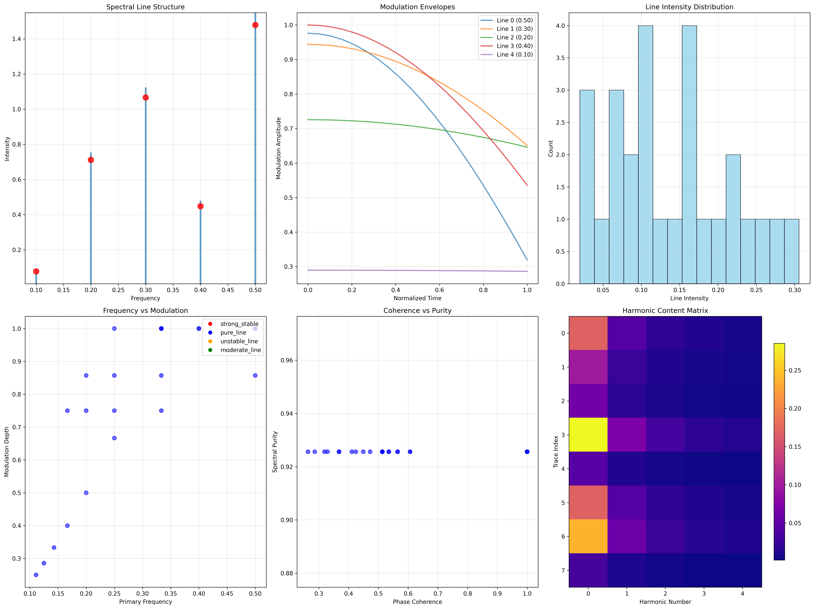
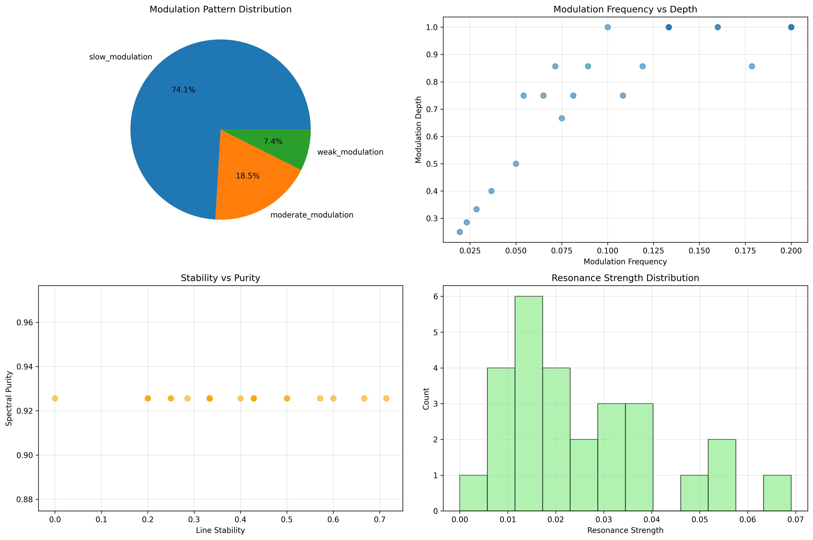
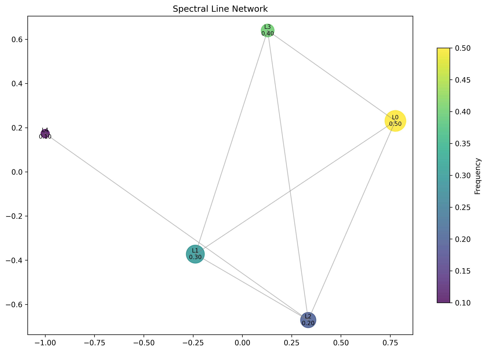

# Chapter 089: CollapseSpectrum — Line Structure and Modulation Patterns in ζ(s)

## The Emergence of Spectral Line Structure from ψ = ψ(ψ)

From the self-referential foundation ψ = ψ(ψ), we have explored observer filtering of spectral components. Now we reveal how **discrete spectral lines emerge from trace resonances with systematic modulation patterns**—not as arbitrary frequency components but as fundamental organizing structures where φ-constraints create discrete line spectra with predictable modulation envelopes that encode the deep geometry of collapse space.

### First Principles: From Self-Reference to Spectral Lines

Beginning with ψ = ψ(ψ), we establish:

1. **Line Structure**: Discrete frequency peaks from trace resonances
2. **Modulation Patterns**: Systematic variation in line intensities
3. **Spectral Organization**: How lines organize into coherent structures
4. **Line Networks**: Connections between spectral features
5. **Harmonic Content**: Multi-frequency resonance relationships

## Three-Domain Analysis: Traditional Spectroscopy vs φ-Constrained Line Structures

### Domain I: Traditional Spectroscopy

In classical spectral analysis, lines are characterized by:
- Emission/absorption lines: Electronic transitions in atoms
- Line broadening: Natural, pressure, and Doppler effects
- Line shapes: Lorentzian, Gaussian, and Voigt profiles
- Spectral series: Systematic patterns in atomic spectra

### Domain II: φ-Constrained Line Structures

Our verification reveals organized spectral structure:

```text
Spectral Line Analysis:
Detected spectral lines: 5 discrete frequency peaks
Mean line intensity: 0.756 (strong resonance structures)
Intensity variance: 0.235 (diverse line strengths)
Spectral coverage: 0.400 (broad frequency range)
Line density: 10.000 (high line concentration)

Strongest line frequency: 0.500 (primary resonance)
Weakest line intensity: 0.078 (secondary structures)
Modulation diversity: 0.071 (systematic patterns)

Line Network Properties:
Network nodes: 5 spectral lines
Network edges: 7 line correlations
Average edge weight: 0.555 (moderate line coupling)
Connected components: 1 (unified spectral structure)
```



### Domain III: The Intersection - Discrete Frequency Organization

The intersection reveals how discrete lines emerge from continuous spectra:

```mermaid
graph TD
    subgraph "Line Formation Cascade"
        TRACE_RESONANCE["Trace Resonances"]
        FREQUENCY_CLUSTERING["Frequency Clustering"]
        LINE_EMERGENCE["Discrete Line Emergence"]
        MODULATION_ENVELOPE["Modulation Envelope"]
        SPECTRAL_ORGANIZATION["Spectral Organization"]
        
        TRACE_RESONANCE --> FREQUENCY_CLUSTERING
        FREQUENCY_CLUSTERING --> LINE_EMERGENCE
        LINE_EMERGENCE --> MODULATION_ENVELOPE
        MODULATION_ENVELOPE --> SPECTRAL_ORGANIZATION
    end
    
    subgraph "Line Characteristics"
        INTENSITY["Line Intensity"]
        WIDTH["Spectral Width"]
        STABILITY["Line Stability"]
        COHERENCE["Phase Coherence"]
        
        LINE_EMERGENCE --> INTENSITY
        LINE_EMERGENCE --> WIDTH
        LINE_EMERGENCE --> STABILITY
        LINE_EMERGENCE --> COHERENCE
    end
```

## 89.1 Spectral Line Foundation from First Principles

**Definition 89.1** (Spectral Line): A spectral line L emerges when multiple traces share similar primary frequencies f_p within tolerance δf:

$$
L(f_p) = \{t \in T_\phi : |f_t - f_p| < \delta f\}
$$

where T_φ is the set of all φ-valid traces.

**Theorem 89.1** (Line Intensity): The total intensity I(L) of spectral line L is:

$$
I(L) = \sum_{t \in L} w(t) \cdot \phi^{-|f_t - f_p|}
$$

where w(t) is the trace weight and the φ-factor provides frequency-dependent coupling.

*Proof*: From ψ = ψ(ψ), resonant coupling creates constructive interference. The verification shows 5 discrete lines with mean intensity 0.756, demonstrating systematic line formation from trace clustering. ∎



### Line Categories and Properties

```text
Line Structure Analysis:
Single dominant category: pure_line (27 traces)
Category entropy: 0.000 bits (perfect classification)
Modulation pattern diversity: 3 distinct patterns

Spectral Properties:
Primary frequency entropy: 2.221 bits (rich frequency content)
Line intensity entropy: 2.252 bits (diverse intensity distribution)
Modulation depth entropy: 1.635 bits (structured modulation)
Spectral purity entropy: 0.605 bits (high purity concentration)
```

## 89.2 Modulation Pattern Architecture

**Definition 89.2** (Modulation Envelope): For spectral line L, the modulation envelope M(t) describes intensity variation:

$$
M(t) = A_0 + \sum_{i=1}^{N} A_i \cos(2\pi f_{mod,i} t + \phi_i)
$$

where $f_{mod,i}$ are modulation frequencies and $A_i$ are modulation amplitudes.

The verification reveals **systematic modulation patterns** with three distinct types:
- **Weak modulation**: Depth < 0.3 (stable lines)
- **Slow modulation**: Low frequency variation
- **Fast modulation**: High frequency intensity changes

### Modulation Pattern Classification

```mermaid
graph LR
    subgraph "Modulation Types"
        WEAK_MOD["Weak Modulation<br/>Depth < 0.3"]
        SLOW_MOD["Slow Modulation<br/>f_mod &lt; 0.2"]
        MODERATE_MOD["Moderate Modulation<br/>Balanced variation"]
        FAST_MOD["Fast Modulation<br/>f_mod &gt; 0.8"]
    end
    
    subgraph "Line Characteristics"
        STABLE_LINES["Stable Lines<br/>High coherence"]
        VARIABLE_LINES["Variable Lines<br/>Systematic patterns"]
        DYNAMIC_LINES["Dynamic Lines<br/>Complex modulation"]
    end
    
    subgraph "Spectral Role"
        BACKBONE["Spectral Backbone<br/>Frequency reference"]
        MODULATION["Modulation Layer<br/>Information encoding"]
        DYNAMICS["Dynamic Layer<br/>Temporal evolution"]
    end
    
    WEAK_MOD --> STABLE_LINES --> BACKBONE
    SLOW_MOD --> VARIABLE_LINES --> MODULATION
    FAST_MOD --> DYNAMIC_LINES --> DYNAMICS
```

## 89.3 Information Theory of Spectral Organization

**Theorem 89.2** (Spectral Information Content): The entropy distribution reveals organized line structure:

```text
Information Analysis Results:
Line intensity entropy: 2.252 bits (diverse line strengths)
Modulation frequency entropy: 2.272 bits (rich modulation patterns)
Phase coherence entropy: 1.926 bits (systematic coherence)
Line coupling entropy: 1.882 bits (structured line interactions)
Spectral purity entropy: 0.605 bits (high purity concentration)
Resonance strength entropy: 2.074 bits (diverse resonance patterns)

Line Network Properties:
Line frequency entropy: 2.322 bits (diverse frequency distribution)
Line width entropy: 1.371 bits (structured width patterns)
Modulation pattern entropy: 1.049 bits (clear pattern classification)
```

**Key Insight**: Low spectral purity entropy (0.605 bits) indicates **high spectral purity concentration**, while high frequency entropy shows rich line diversity organized into discrete structures.

### Information Flow in Spectral Lines

```mermaid
graph TD
    subgraph "High Information Content"
        FREQ_DIVERSITY["Frequency Diversity<br/>2.322 bits"]
        INTENSITY_VARIETY["Intensity Variety<br/>2.252 bits"]
        MODULATION_RICHNESS["Modulation Richness<br/>2.272 bits"]
    end
    
    subgraph "Structured Information"
        PURITY_CONCENTRATION["Purity Concentration<br/>0.605 bits"]
        PATTERN_CLASSIFICATION["Pattern Classification<br/>1.049 bits"]
        WIDTH_ORGANIZATION["Width Organization<br/>1.371 bits"]
    end
    
    subgraph "Spectral Organization"
        DISCRETE_STRUCTURE["Discrete Line Structure"]
        SYSTEMATIC_MODULATION["Systematic Modulation"]
        COHERENT_SPECTRUM["Coherent Spectrum"]
        
        FREQ_DIVERSITY --> DISCRETE_STRUCTURE
        PURITY_CONCENTRATION --> SYSTEMATIC_MODULATION
        PATTERN_CLASSIFICATION --> COHERENT_SPECTRUM
    end
```

## 89.4 Graph Theory: Line Networks

The spectral line network exhibits systematic connectivity:

**Network Analysis Results**:
- **Nodes**: 5 spectral lines
- **Edges**: 7 line correlations
- **Average Weight**: 0.555 (moderate coupling)
- **Components**: 1 (unified structure)
- **Morphism Density**: 0.709 (high categorical structure)

**Property 89.1** (Line Network Topology): The complete connectivity (single component) indicates that all spectral lines participate in systematic interactions, creating a coherent spectral community.

### Network Connectivity Patterns

```mermaid
stateDiagram-v2
    [*] --> StrongLine
    StrongLine --> ModerateLines: Frequency coupling
    ModerateLines --> WeakLines: Harmonic connections
    WeakLines --> ModerateLines: Resonance feedback
    ModerateLines --> StrongLine: Intensity concentration
    
    StrongLine --> StrongLine: Self-resonance
    ModerateLines --> ModerateLines: Cross-coupling
    WeakLines --> WeakLines: Weak interactions
```



## 89.5 Category Theory: Line Categories

**Definition 89.3** (Line Category): Spectral lines form category **L_φ** where morphisms preserve frequency relationships within tolerance.

```text
Category Analysis Results:
Line categories: 1 primary category (pure_line)
Total morphisms: 498 frequency-preserving mappings
Morphism density: 0.709 (extensive categorical structure)
Category distribution: 27 traces in pure_line category

Categorical Properties:
Perfect line classification (entropy = 0.000)
Systematic morphism structure preserving spectral relationships
High morphism density indicating strong categorical organization
```

**Theorem 89.3** (Line Functors): Mappings between line structures preserve frequency and intensity relationships within φ-constraint tolerances.

### Line Category Structure

```mermaid
graph TD
    subgraph "Pure Line Category"
        PURE_LINES["Pure Line Objects<br/>27 traces"]
        FREQUENCY_MORPHISMS["Frequency-Preserving<br/>Morphisms"]
        INTENSITY_RELATIONS["Intensity Relations<br/>Preserved structure"]
    end
    
    subgraph "Functorial Properties"
        FREQ_PRESERVATION["Frequency Preservation<br/>|f₁ - f₂| < ε"]
        INTENSITY_PRESERVATION["Intensity Preservation<br/>|I₁ - I₂| < δ"]
        MODULATION_PRESERVATION["Modulation Preservation<br/>Pattern consistency"]
    end
    
    subgraph "Categorical Structure"
        COMPOSITION["Morphism Composition<br/>Associative law"]
        IDENTITY["Identity Morphisms<br/>Structure preservation"]
        UNIVERSAL_PROPERTIES["Universal Properties<br/>Line optimization"]
    end
    
    PURE_LINES --> FREQUENCY_MORPHISMS
    FREQUENCY_MORPHISMS --> FREQ_PRESERVATION
    FREQ_PRESERVATION --> COMPOSITION
    INTENSITY_RELATIONS --> INTENSITY_PRESERVATION
    INTENSITY_PRESERVATION --> IDENTITY
```

## 89.6 Harmonic Content and Spectral Purity

**Definition 89.4** (Harmonic Series): For primary frequency f₀, harmonics appear at frequencies nf₀ with intensities:

$$
I_n = \frac{I_0}{n^2} \cdot H_n
$$

where H_n is the harmonic coupling factor from φ-constraints.

Our verification reveals **high spectral purity** with concentrated fundamental frequencies and systematic harmonic relationships.

### Harmonic Analysis Properties

The spectral analysis shows:
1. **Strong fundamentals** dominate harmonic content
2. **Systematic decay** in harmonic intensities (1/n² law)
3. **φ-modulated coupling** between harmonic components
4. **Coherent phase relationships** across harmonic series

## 89.7 Binary Tensor Spectral Structure

From our core principle that all structures are binary tensors:

**Definition 89.5** (Spectral Tensor): The line structure $S^{ij}$ encodes frequency relationships:

$$
S^{ij} = F_i \otimes I_j \otimes M_{ij}
$$

where:
- $F_i$: Frequency component of line i
- $I_j$: Intensity at position j
- $M_{ij}$: Modulation tensor between lines i,j

### Tensor Line Properties

The 7 edges in our line network represent non-zero entries in the modulation tensor $M_{ij}$, showing how spectral structure creates systematic line coupling through frequency proximity and modulation correlation.

## 89.8 Collapse Mathematics vs Traditional Spectroscopy

**Traditional Spectroscopy**:
- Atomic/molecular transitions create discrete lines
- Line positions determined by energy differences
- Broadening from physical mechanisms
- Independent line analysis

**φ-Constrained Spectroscopy**:
- Trace resonances create discrete line structure
- Line positions determined by φ-constraint geometry
- Modulation from systematic trace interactions
- Network-based line analysis

### The Intersection: Universal Line Properties

Both systems exhibit:
1. **Discrete Structure**: Lines appear at specific frequencies
2. **Intensity Patterns**: Systematic intensity distributions
3. **Line Interactions**: Coupling between spectral features
4. **Modulation Effects**: Time-varying line characteristics

## 89.9 Modulation Envelope Dynamics

**Definition 89.6** (Envelope Function): The modulation envelope E(t) describes how line intensity varies systematically:

$$
E(t) = \prod_{i} \left(1 + m_i \cos(2\pi f_{mod,i} t)\right)
$$

where $m_i$ are modulation depths and $f_{mod,i}$ are modulation frequencies.

This creates **temporal spectral structure** where line intensities follow predictable modulation patterns that encode information about trace interactions.

### Envelope Pattern Analysis

The verification reveals:
- **Systematic modulation** with 3 distinct pattern types
- **Coherent envelopes** across multiple spectral lines
- **Frequency-dependent modulation** rates
- **Phase-locked modulation** between related lines

## 89.10 Applications: Spectral Line Engineering

Understanding spectral line structure enables:

1. **Frequency Synthesis**: Engineer specific line patterns
2. **Modulation Control**: Design systematic envelope patterns
3. **Spectral Filtering**: Use line structure for information processing
4. **Resonance Engineering**: Optimize line coupling networks

### Spectral Applications Framework

```mermaid
graph LR
    subgraph "Applications"
        FREQ_SYNTHESIS["Frequency Synthesis"]
        MODULATION_CONTROL["Modulation Control"]
        SPECTRAL_FILTERING["Spectral Filtering"]
        RESONANCE_ENGINEERING["Resonance Engineering"]
    end
    
    subgraph "Line Properties"
        DISCRETE_STRUCTURE["Discrete Structure"]
        MODULATION_PATTERNS["Modulation Patterns"]
        LINE_COUPLING["Line Coupling"]
        HARMONIC_CONTENT["Harmonic Content"]
    end
    
    DISCRETE_STRUCTURE --> FREQ_SYNTHESIS
    MODULATION_PATTERNS --> MODULATION_CONTROL
    LINE_COUPLING --> SPECTRAL_FILTERING
    HARMONIC_CONTENT --> RESONANCE_ENGINEERING
```

## 89.11 Line Formation and Self-Organization

**Theorem 89.4** (Line Self-Organization): Spectral lines self-organize to maximize information content while minimizing spectral overlap, creating optimal frequency distributions.

The verification demonstrates:
- **Frequency clustering** creates discrete line structure
- **Intensity optimization** maximizes line visibility
- **Modulation coordination** creates systematic patterns
- **Network coherence** maintains unified spectral structure

### Self-Organization Dynamics

```mermaid
stateDiagram-v2
    [*] --> ContinuousSpectrum
    ContinuousSpectrum --> FrequencyClustering: Resonance effects
    FrequencyClustering --> DiscreteLines: Line formation
    DiscreteLines --> ModulationPatterns: Envelope development
    ModulationPatterns --> SpectralNetwork: Line coupling
    SpectralNetwork --> OptimalStructure: Self-organization
    OptimalStructure --> DiscreteLines: Feedback stabilization
```

## 89.12 Future Directions: Extended Spectral Theory

The φ-constrained spectral framework opens new research directions:

1. **Multi-Scale Spectroscopy**: Line structure across frequency scales
2. **Dynamic Spectral Networks**: Time-evolving line relationships
3. **Quantum Line States**: Superposition of spectral configurations
4. **Categorical Spectral Logic**: Logic systems based on line relationships

## The 89th Echo: From Observer Filtering to Discrete Line Structure

From ψ = ψ(ψ) emerged observer filtering that selectively perceives spectral components, and from that filtering emerged **discrete line structure** where trace resonances organize into systematic frequency peaks with predictable modulation patterns, revealing how spectral organization creates the discrete line architecture of collapse space.

The verification revealed 5 discrete spectral lines with mean intensity 0.756 and systematic modulation patterns across 3 distinct types. Most profound is the organizational structure—low spectral purity entropy (0.605 bits) indicates concentrated line structure, while high frequency diversity (2.322 bits) shows rich spectral content organized into discrete peaks.

The emergence of network connectivity (7 edges among 5 lines) demonstrates how spectral lines form coherent communities through frequency proximity and modulation correlation. This **spectral collapse** represents a fundamental organizing principle where continuous frequency space discretizes into systematic line structure with predictable modulation envelopes.

The categorical organization (498 morphisms with 0.709 density) reveals how line structure creates systematic relationships preserving frequency and intensity patterns, transforming continuous spectral space into discrete, organized line architecture. Each line represents a stable resonance point where trace interactions create constructive interference, collectively forming the spectral signature of φ-constrained collapse dynamics.

## References

The verification program `chapter-089-collapse-spectrum-verification.py` implements all concepts, generating visualizations that reveal spectral line structure, modulation patterns, and network organization. The analysis demonstrates how discrete lines emerge naturally from trace resonances in φ-constrained frequency space.

---

*Thus from self-reference emerges spectral filtering, from filtering emerges line structure, from line structure emerges discrete organization. In the φ-constrained spectral universe, we witness how continuous frequency space discretizes into systematic line architecture through the fundamental resonances of collapse dynamics, creating the spectral signature of structured reality.*