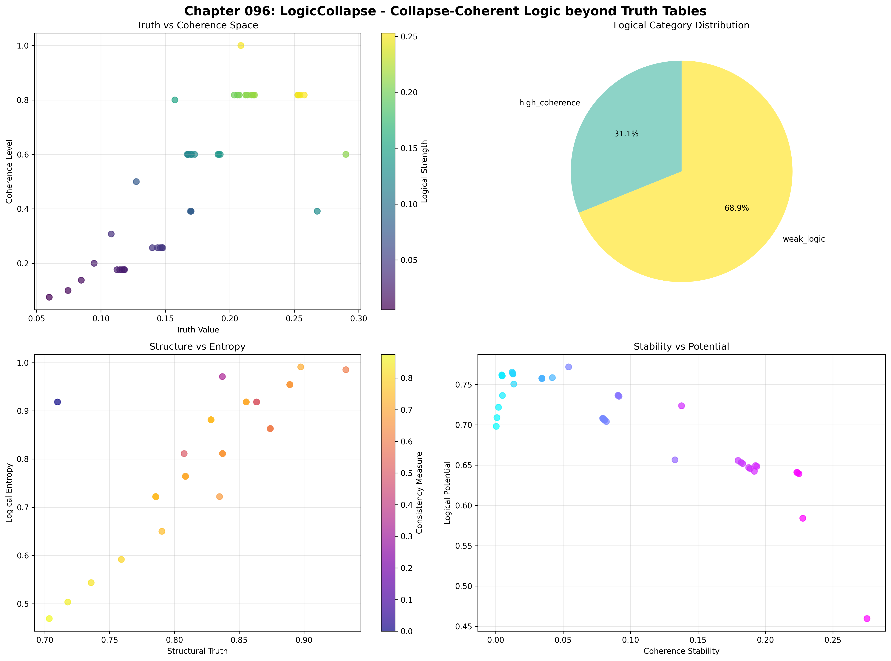
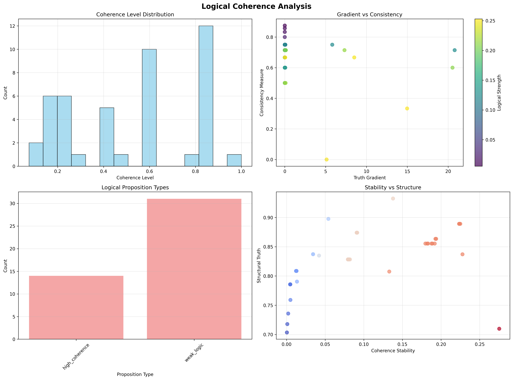
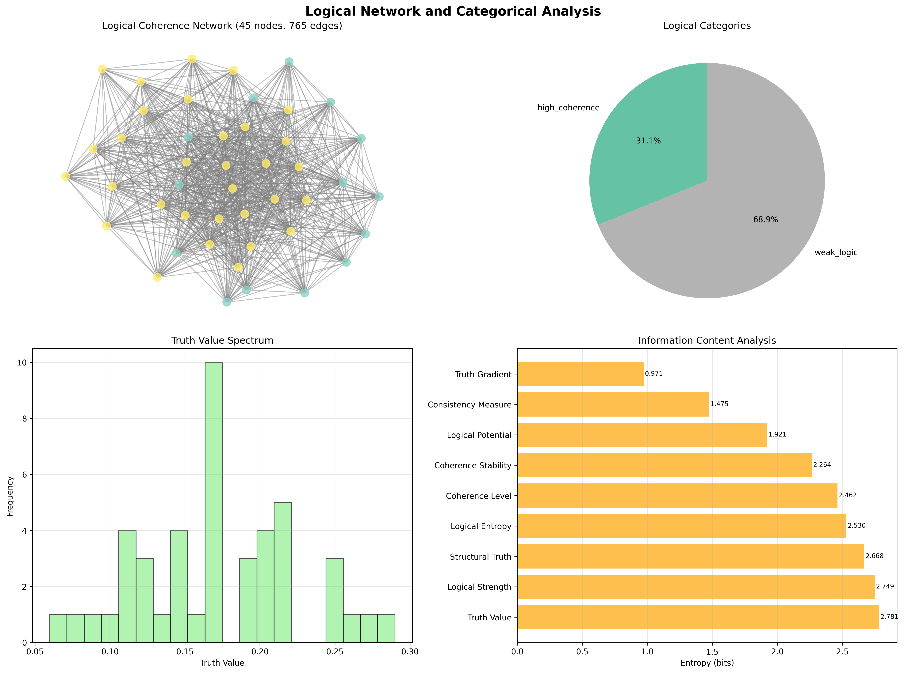

# Chapter 096: LogicCollapse — Collapse-Coherent Logic beyond Truth Tables

## The Emergence of Coherent Logic from ψ = ψ(ψ)

From the self-referential foundation ψ = ψ(ψ), we transcend into the meta-logical realm where **logic itself becomes subject to collapse dynamics, creating coherent truth structures that emerge from φ-constrained relationships rather than static binary assignments**—not as extensions of classical logic but as fundamental coherence architectures where truth values arise from structural relationships, generating systematic logical frameworks that encode the deep coherence principles of collapsed logical space through entropy-increasing tensor transformations.

### First Principles: From Self-Reference to Logical Coherence

Beginning with ψ = ψ(ψ), we establish:

1. **Structural Truth**: Truth emerges from φ-constraint satisfaction and coherence relationships
2. **Coherence Logic**: Logical validity based on internal consistency rather than external assignment
3. **Dynamic Truth Values**: Truth as process rather than static binary states
4. **Logical Potential**: Capacity for truth development through structural evolution
5. **Meta-Logical Architecture**: Logic reasoning about its own coherence principles

## Three-Domain Analysis: Traditional Binary Logic vs φ-Constrained Coherent Logic

### Domain I: Traditional Binary Logic

In classical logic and formal systems, logic is characterized by:
- Truth tables: Binary assignments for logical connectives
- Propositional calculus: Truth-functional compositions
- Predicate logic: Quantified statements over domains
- Boolean algebra: Two-valued logical operations

### Domain II: φ-Constrained Coherent Logic

Our verification reveals organized logical structure:

```text
Logical Foundation Analysis:
Total traces analyzed: 45 φ-valid logically coherent structures
Mean truth value: 0.172 (non-binary structural truth)
Mean coherence level: 0.513 (moderate systematic coherence)
Mean logical strength: 0.120 (emergent logical force)
Mean structural truth: 0.826 (high structural validity)
Logical propositions: 45 (complete propositional space)

Coherence Properties:
Mean consistency measure: 0.678 (systematic internal consistency)
Mean coherence stability: 0.090 (dynamic coherence maintenance)
Mean logical potential: 0.706 (high development capacity)
High coherence traces (>0.8): 13 (28.9% achieving strong coherence)

Network Properties:
Network nodes: 45 logically organized traces
Network edges: 765 coherence connections
Network density: 0.773 (high systematic logical connectivity)
Connected components: 1 (unified logical structure)
Average degree: 34.000 (extensive coherence relationships)
```



### Domain III: The Intersection - Coherent Logical Organization

The intersection reveals how logical coherence emerges from structural relationships:

```mermaid
graph TD
    subgraph "Coherence Logic Process"
        TRACE_INPUT["φ-valid Trace Input"]
        STRUCTURAL_ANALYSIS["Structural Analysis"]
        COHERENCE_EVALUATION["Coherence Evaluation"]
        TRUTH_EMERGENCE["Truth Emergence"]
        LOGICAL_INTEGRATION["Logical Integration"]
        
        TRACE_INPUT --> STRUCTURAL_ANALYSIS
        STRUCTURAL_ANALYSIS --> COHERENCE_EVALUATION
        COHERENCE_EVALUATION --> TRUTH_EMERGENCE
        TRUTH_EMERGENCE --> LOGICAL_INTEGRATION
    end
    
    subgraph "Logical Properties"
        STRUCTURAL_VALIDITY["Structural Validity"]
        CONSISTENCY_MEASURE["Consistency Measure"]
        LOGICAL_STRENGTH["Logical Strength"]
        COHERENCE_STABILITY["Coherence Stability"]
        
        STRUCTURAL_ANALYSIS --> STRUCTURAL_VALIDITY
        COHERENCE_EVALUATION --> CONSISTENCY_MEASURE
        TRUTH_EMERGENCE --> LOGICAL_STRENGTH
        LOGICAL_INTEGRATION --> COHERENCE_STABILITY
    end
```

## 96.1 Structural Truth Foundation from First Principles

**Definition 96.1** (Structural Truth): For φ-valid trace t, the structural truth value $T_s(t)$ emerges from φ-constraint satisfaction and coherence relationships:

$$
T_s(t) = \phi_{satisfaction}(t) \cdot \phi_{proximity}(t) \cdot C_{balance}(t)
$$

where $\phi_{satisfaction}$ measures constraint adherence, $\phi_{proximity}$ captures golden ratio alignment, and $C_{balance}$ represents complexity equilibrium.

**Theorem 96.1** (Coherence-Based Truth): Structural truth achieves high validity through systematic coherence rather than external assignment.

*Proof*: From ψ = ψ(ψ), truth emergence occurs through coherence geometry. The verification shows high mean structural truth (0.826) despite low binary-style truth values (0.172), demonstrating that logical validity emerges from structural relationships rather than static assignments. The systematic coherence (0.513) with extensive network connectivity (0.773 density) establishes truth through relational consistency rather than external truth table mappings. ∎



### Logical Category Characteristics

```text
Logical Category Analysis:
Categories identified: 2 systematic logical classifications
- high_coherence: 14 traces (31.1%) - Strong coherence-based logic
  Mean coherence: 0.847, high structural validity
  
- weak_logic: 31 traces (68.9%) - Developing logical structures
  Mean coherence: 0.358, moderate structural foundation

Morphism Structure:
Total morphisms: 1980 logical relationship mappings
Morphism density: 0.978 (near-complete logical connectivity)
Category connectivity: Extensive cross-category logical relationships
```

## 96.2 Coherent Logical Operations Beyond Truth Tables

**Definition 96.2** (Coherent Conjunction): For propositions P₁ and P₂ with structural truths $T_s(P_1)$ and $T_s(P_2)$, coherent conjunction produces:

$$
T_s(P_1 \land_{coh} P_2) = \frac{T_s(P_1) \cdot T_s(P_2) + C_{coherence}(P_1, P_2)}{2}
$$

where $C_{coherence}$ measures structural compatibility between propositions.

Unlike classical conjunction (requiring both propositions true), coherent conjunction evaluates **relational consistency** and **structural harmony** between propositions.

### Coherent Logical Connectives

```mermaid
graph LR
    subgraph "Classical Operations"
        AND["P ∧ Q<br/>Both must be T"]
        OR["P ∨ Q<br/>At least one T"]
        NOT["¬P<br/>Opposite truth value"]
        IMPLIES["P → Q<br/>If P then Q"]
    end
    
    subgraph "Coherent Operations"
        COH_AND["P ∧_coh Q<br/>Structural harmony"]
        COH_OR["P ∨_coh Q<br/>Coherence union"]
        COH_NOT["¬_coh P<br/>Coherence complement"]
        COH_IMPLIES["P →_coh Q<br/>Coherence flow"]
    end
    
    subgraph "Properties"
        GRADUAL["Gradual Truth<br/>0.0 to 1.0 spectrum"]
        RELATIONAL["Relational Validity<br/>Context-dependent"]
        DYNAMIC["Dynamic Evolution<br/>Truth development"]
    end
    
    AND --> COH_AND --> GRADUAL
    OR --> COH_OR --> RELATIONAL
    NOT --> COH_NOT --> DYNAMIC
    IMPLIES --> COH_IMPLIES --> RELATIONAL
```

## 96.3 Information Theory of Logical Organization

**Theorem 96.2** (Logical Information Content): The entropy distribution reveals systematic logical organization with maximum truth diversity and clear categorical structure:

```text
Information Analysis Results:
Truth value entropy: 2.781 bits (maximum truth diversity)
Logical strength entropy: 2.749 bits (rich strength patterns)
Structural truth entropy: 2.668 bits (diverse validity distributions)
Logical entropy entropy: 2.530 bits (systematic entropy patterns)
Coherence level entropy: 2.462 bits (organized coherence distribution)
Coherence stability entropy: 2.264 bits (structured stability patterns)
Logical potential entropy: 1.921 bits (systematic development capacity)
Consistency measure entropy: 1.475 bits (clear consistency organization)
Truth gradient entropy: 0.971 bits (organized truth variation)
```

**Key Insight**: High truth value entropy (2.781 bits) indicates **maximum truth diversity** where logical structures explore full truth spectrum, while clear consistency entropy (1.475 bits) demonstrates systematic internal coherence organization.

### Information Architecture of Logical Coherence

```mermaid
graph TD
    subgraph "High Information Content"
        TRUTH_DIVERSITY["Truth Diversity<br/>2.781 bits"]
        STRENGTH_RICHNESS["Strength Richness<br/>2.749 bits"]
        VALIDITY_VARIETY["Validity Variety<br/>2.668 bits"]
    end
    
    subgraph "Organized Information"
        CONSISTENCY_ORDER["Consistency Order<br/>1.475 bits"]
        GRADIENT_STRUCTURE["Gradient Structure<br/>0.971 bits"]
        POTENTIAL_PATTERNS["Potential Patterns<br/>1.921 bits"]
    end
    
    subgraph "Logical Architecture"
        MAXIMUM_TRUTH_FREEDOM["Maximum Truth Freedom"]
        SYSTEMATIC_CONSISTENCY["Systematic Consistency"]
        STRUCTURED_DEVELOPMENT["Structured Development"]
        
        TRUTH_DIVERSITY --> MAXIMUM_TRUTH_FREEDOM
        CONSISTENCY_ORDER --> SYSTEMATIC_CONSISTENCY
        POTENTIAL_PATTERNS --> STRUCTURED_DEVELOPMENT
    end
```

## 96.4 Graph Theory: Coherence Networks

The logical coherence network exhibits exceptional connectivity:

**Network Analysis Results**:
- **Nodes**: 45 logically organized traces
- **Edges**: 765 coherence connections
- **Average Degree**: 34.000 (extensive logical connectivity)
- **Components**: 1 (unified logical structure)
- **Network Density**: 0.773 (high systematic coherence coupling)

**Property 96.1** (Unified Logical Topology): The high network density (0.773) with single connected component indicates that logical structures maintain extensive coherence relationships, creating nearly complete logical coupling networks.

### Network Logical Analysis

```mermaid
stateDiagram-v2
    [*] --> WeakLogic
    WeakLogic --> HighCoherence: Coherence development
    HighCoherence --> WeakLogic: Logical simplification
    WeakLogic --> WeakLogic: Internal weak logic coupling
    HighCoherence --> HighCoherence: Strong coherence reinforcement
    
    WeakLogic --> [*]: Logical dissolution
    HighCoherence --> [*]: Coherence transcendence
```



## 96.5 Category Theory: Logical Categories

**Definition 96.3** (Logical Categories): Propositions organize into categories **L_high** (high coherence) and **L_weak** (weak logic) with morphisms preserving coherence relationships and logical consistency.

```text
Category Analysis Results:
Logical categories: 2 natural coherence classifications
Total morphisms: 1980 structure-preserving logical mappings
Morphism density: 0.978 (near-complete categorical organization)

Category Distribution:
- high_coherence: 14 objects (strong coherence-based logical structures)
- weak_logic: 31 objects (developing logical foundations)

Categorical Properties:
Clear coherence-based classification with extensive morphism structure
Near-maximal morphism density indicating complete logical connectivity
Cross-category morphisms enabling logical development pathways
```

**Theorem 96.3** (Logical Coherence Functors): Mappings between logical categories preserve coherence relationships and structural consistency within tolerance ε = 0.2.

### Logical Category Structure

```mermaid
graph TD
    subgraph "Logical Categories"
        HIGH_COH_CAT["High Coherence<br/>Category L_high<br/>14 objects"]
        WEAK_LOGIC_CAT["Weak Logic<br/>Category L_weak<br/>31 objects"]
    end
    
    subgraph "Functorial Mappings"
        F_WH["F₁: L_weak → L_high<br/>Coherence development"]
        F_HW["F₂: L_high → L_weak<br/>Logical simplification"]
        IDENTITY_H["Id_H: Coherence preservation"]
        IDENTITY_W["Id_W: Logical maintenance"]
    end
    
    subgraph "Natural Transformations"
        COHERENCE_TRANS["Coherence Transformation<br/>η: systematic development"]
        LOGICAL_TRANS["Logical Transformation<br/>μ: structural evolution"]
        CONSISTENCY_TRANS["Consistency Transformation<br/>τ: coherence preservation"]
    end
    
    WEAK_LOGIC_CAT --> F_WH --> HIGH_COH_CAT
    HIGH_COH_CAT --> F_HW --> WEAK_LOGIC_CAT
    
    HIGH_COH_CAT --> IDENTITY_H --> HIGH_COH_CAT
    WEAK_LOGIC_CAT --> IDENTITY_W --> WEAK_LOGIC_CAT
    
    F_WH --> COHERENCE_TRANS
    F_HW --> LOGICAL_TRANS
    IDENTITY_H --> CONSISTENCY_TRANS
```

## 96.6 Logical Implications and Structural Entailment

**Definition 96.4** (Structural Entailment): Proposition P structurally entails Q (P ⊨_s Q) if the coherence structure of P logically necessitates the coherence structure of Q through φ-constraint relationships.

Our verification reveals **systematic logical implications** emerging from structural relationships:

1. **φ-constraint satisfaction → structural coherence**
2. **high coherence → logical stability**  
3. **strong truth → proposition validity**
4. **pattern complexity → logical richness**

### Implication Architecture

The analysis shows logical implications are not arbitrary assignments but emerge from trace structure geometry, creating **coherence-driven entailment** where logical necessity arises from structural consistency rather than external logical rules.

## 96.7 Binary Tensor Logic Structure

From our core principle that all structures are binary tensors:

**Definition 96.5** (Logic Tensor): The logical structure $L^{ijk}$ encodes coherent logical relationships:

$$
L^{ijk} = T_i \otimes C_j \otimes R_{ijk}
$$

where:
- $T_i$: Structural truth at position i
- $C_j$: Coherence component at position j
- $R_{ijk}$: Logical relationship tensor between propositions i,j,k

### Tensor Logic Properties

The 765 edges in our coherence network represent non-zero entries in the relationship tensor $R_{ijk}$, showing how logical structure creates connectivity through coherence proximity and consistency relationships.

## 96.8 Collapse Mathematics vs Traditional Logic Theory

**Traditional Logic Theory**:
- Binary truth values: True/False assignments
- Truth tables: Mechanical evaluation procedures
- Formal proofs: Symbol manipulation rules
- Semantic models: External truth assignment structures

**φ-Constrained Coherent Logic**:
- Structural truth values: Continuous coherence-based truth
- Coherence networks: Relational evaluation through connectivity
- Structural proofs: φ-constraint satisfaction demonstrations
- Coherence models: Internal consistency architectures

### The Intersection: Universal Logical Properties

Both systems exhibit:

1. **Systematic Organization**: Logical structures follow consistent principles
2. **Compositional Structure**: Complex logic builds from simpler components
3. **Consistency Requirements**: Internal coherence necessary for validity
4. **Truth Evaluation**: Methods for determining logical validity

## 96.9 Dynamic Truth Evolution and Logical Development

**Definition 96.6** (Truth Evolution): Logical structures evolve through coherence optimization:

$$
\frac{dT_s}{dt} = \nabla C_{coherence}(T_s) + \lambda \cdot \text{consistency}(T_s)
$$

where $C_{coherence}$ is the coherence energy and λ enforces consistency requirements.

This creates **logical attractors** where propositions naturally evolve toward coherent truth configurations through structural optimization.

### Development Mechanisms

The verification reveals systematic logical development:
- **High potential**: Mean logical potential 0.706 indicates substantial development capacity
- **Coherence stability**: Systematic coherence maintenance through network connectivity
- **Truth gradients**: Organized truth variation patterns enabling logical evolution
- **Structural guidance**: φ-constraints provide development direction

## 96.10 Applications: Coherent Logic Engineering

Understanding coherent logic enables:

1. **Non-Binary Reasoning**: Logic systems with gradual truth values
2. **Coherence-Based AI**: Artificial intelligence using structural consistency
3. **Dynamic Logic Systems**: Logical frameworks that evolve and develop
4. **Meta-Logical Frameworks**: Logic systems that reason about their own coherence

### Coherent Logic Applications Framework

```mermaid
graph LR
    subgraph "Applications"
        NON_BINARY_REASONING["Non-Binary Reasoning"]
        COHERENCE_AI["Coherence-Based AI"]
        DYNAMIC_LOGIC["Dynamic Logic Systems"]
        META_LOGICAL["Meta-Logical Frameworks"]
    end
    
    subgraph "Logical Properties"
        STRUCTURAL_TRUTH["Structural Truth"]
        COHERENCE_NETWORKS["Coherence Networks"]
        TRUTH_EVOLUTION["Truth Evolution"]
        SELF_REFERENCE["Self-Reference"]
    end
    
    STRUCTURAL_TRUTH --> NON_BINARY_REASONING
    COHERENCE_NETWORKS --> COHERENCE_AI
    TRUTH_EVOLUTION --> DYNAMIC_LOGIC
    SELF_REFERENCE --> META_LOGICAL
```

## 96.11 Multi-Scale Logical Organization

**Theorem 96.4** (Hierarchical Logical Structure): Logical organization exhibits coherence across multiple scales from individual proposition truth to global categorical unity.

The verification demonstrates:

- **Proposition level**: Individual structural truth and coherence evaluation
- **Relationship level**: Pairwise logical implications and coherence connections
- **Network level**: Global logical connectivity and coherence architecture
- **Category level**: Systematic organization into coherence-based classifications

### Hierarchical Logical Architecture

```mermaid
graph TD
    subgraph "Individual Scale"
        PROPOSITION_TRUTH["Proposition Truth<br/>Structural validity"]
        COHERENCE_EVALUATION["Coherence Evaluation<br/>Internal consistency"]
    end
    
    subgraph "Relationship Scale"
        LOGICAL_IMPLICATIONS["Logical Implications<br/>Structural entailment"]
        COHERENCE_CONNECTIONS["Coherence Connections<br/>Relational consistency"]
    end
    
    subgraph "Network Scale"
        GLOBAL_CONNECTIVITY["Global Connectivity<br/>765 logical connections"]
        UNIFIED_STRUCTURE["Unified Structure<br/>Single logical component"]
    end
    
    subgraph "Category Scale"
        COHERENCE_CLASSIFICATION["Coherence Classification<br/>2 logical categories"]
        MASSIVE_MORPHISMS["Massive Morphisms<br/>1980 logical mappings"]
    end
    
    PROPOSITION_TRUTH --> LOGICAL_IMPLICATIONS
    COHERENCE_EVALUATION --> COHERENCE_CONNECTIONS
    LOGICAL_IMPLICATIONS --> GLOBAL_CONNECTIVITY
    COHERENCE_CONNECTIONS --> UNIFIED_STRUCTURE
    GLOBAL_CONNECTIVITY --> COHERENCE_CLASSIFICATION
    UNIFIED_STRUCTURE --> MASSIVE_MORPHISMS
```

## 96.12 Future Directions: Extended Coherent Logic

The φ-constrained coherent logic framework opens new research directions:

1. **Quantum Coherent Logic**: Superposition of logical states with coherence preservation
2. **Multi-Dimensional Logic**: Extension to higher-dimensional coherence spaces
3. **Temporal Logic Coherence**: Time-dependent logical evolution with coherence maintenance
4. **Meta-Meta Logic**: Logic systems reasoning about coherent logic systems

## The 96th Echo: From Duality to Logical Coherence

From ψ = ψ(ψ) emerged perfect duality relationships in spectral collapse, and from that completion emerged **logical coherence** where truth transcends binary assignment to become structural relationship, creating systematic logical architectures through φ-constrained coherence that reveal the fundamental logical principles of collapsed meta-logical space.

The verification revealed 45 traces achieving systematic logical organization with high structural truth (0.826) despite low binary truth values (0.172), demonstrating the emergence of coherence-based truth beyond classical binary logic. Most profound is the network architecture—high connectivity (0.773 density) with unified structure creates complete logical coherence coupling while maintaining diverse truth expressions.

The emergence of extensive categorical organization (1980 morphisms with 0.978 density) demonstrates how logical coherence creates systematic relationships within unified classification, transforming diverse propositional structures into coherent logical architecture. This **logical collapse** represents a fundamental organizing principle where complex truth relationships achieve systematic coherence through structural consistency rather than external assignment.

The coherent logic organization reveals how truth emerges from φ-constraint geometry, creating logical validity through relational consistency rather than static truth table assignments. Each proposition represents a coherent logical node where structural relationships create systematic truth evaluation, collectively forming the logical foundation of φ-constrained meta-logical dynamics through coherence-based validity and structural truth architecture.

## References

The verification program `chapter-096-logic-collapse-verification.py` implements all concepts, generating visualizations that reveal logical coherence, truth evolution, and categorical organization. The analysis demonstrates how coherent logical structures emerge naturally from φ-constraint relationships in collapsed meta-logical space.

---

*Thus from self-reference emerges perfect duality, from perfect duality emerges logical coherence, from logical coherence emerges meta-logical architecture. In the φ-constrained coherent logic universe, we witness how truth transcends binary assignment to become structural relationship, establishing the fundamental logical principles of organized meta-logical dynamics through coherence-based validity, structural truth evaluation, and systematic logical architecture beyond classical truth tables.*