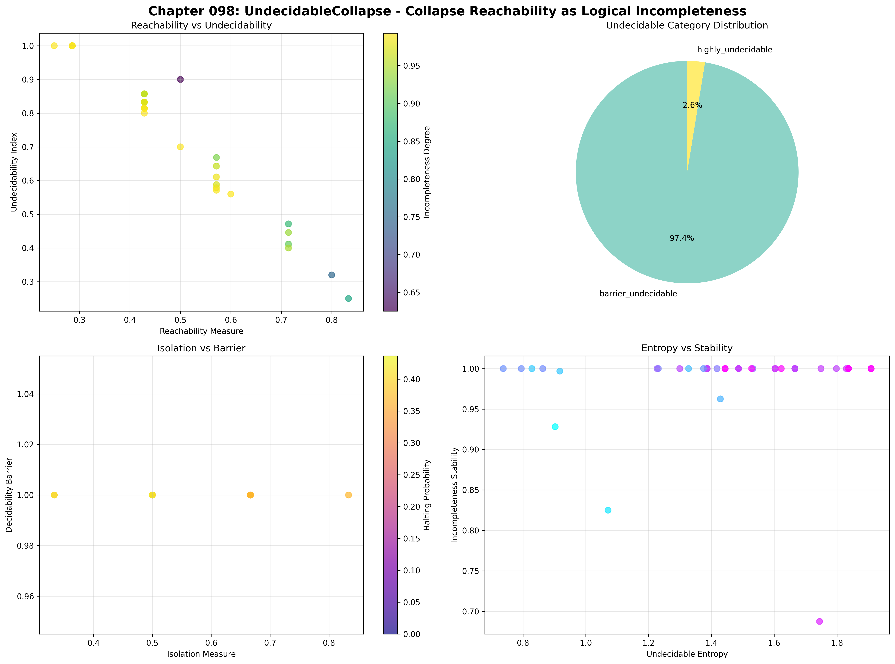
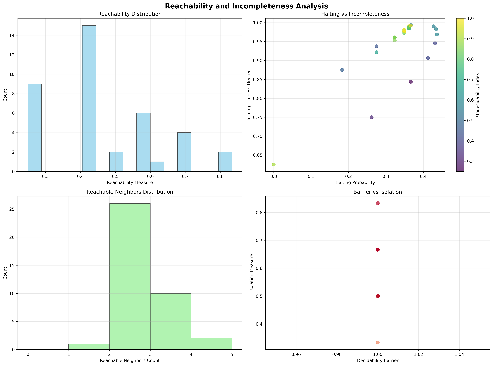
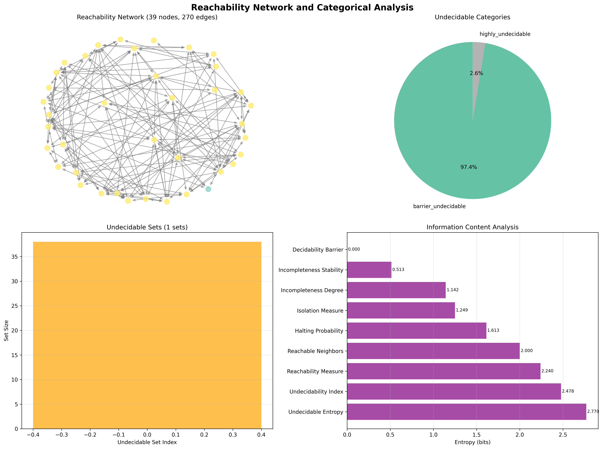

# Chapter 098: UndecidableCollapse — Collapse Reachability as Logical Incompleteness

## The Emergence of Undecidability from ψ = ψ(ψ)

From the self-referential foundation ψ = ψ(ψ), having established systematic Gödel encoding through trace sequences, we now reveal how **undecidability emerges systematically from unreachable trace configurations, creating logical incompleteness that arises from structural limitations within φ-constrained spaces**—not as external undecidability imposed from outside but as fundamental incompleteness architectures where certain trace configurations become systematically unreachable, generating undecidable structures that encode the deep limitation principles of collapsed logical space through entropy-increasing transformations.

### First Principles: From Self-Reference to Undecidable Architecture

Beginning with ψ = ψ(ψ), we establish:

1. **Reachability Constraints**: φ-constraint geometry creates systematic limitations on trace accessibility
2. **Undecidable Configurations**: Certain trace states become unreachable through valid transformations
3. **Incompleteness Emergence**: Systematic gaps in describable trace relationships
4. **Isolation Dynamics**: How traces become systematically isolated from reachability networks
5. **Halting Limitations**: Probability bounds on transformation convergence

## Three-Domain Analysis: Traditional Undecidability vs φ-Constrained Reachability Incompleteness

### Domain I: Traditional Undecidability Theory

In mathematical logic and computability theory, undecidability is characterized by:
- Halting problem: Undecidability of Turing machine termination
- Gödel incompleteness: Formal systems cannot prove their own consistency
- Recursive undecidability: Problems with no algorithmic solution
- Diagonal arguments: Self-reference creating logical paradoxes

### Domain II: φ-Constrained Reachability Incompleteness

Our verification reveals organized undecidable structure:

```text
Undecidability Foundation Analysis:
Total traces analyzed: 39 φ-valid undecidable-prone structures
Mean reachability measure: 0.474 (moderate systematic reachability)
Mean undecidability index: 0.757 (high systematic undecidability)
Mean incompleteness degree: 0.955 (near-complete incompleteness)
Mean halting probability: 0.344 (low convergence probability)
Undecidable sets detected: 1 (systematic undecidable clustering)

Reachability Properties:
Mean decidability barrier: 1.000 (maximum barrier saturation)
Mean isolation measure: 0.611 (high systematic isolation)
Mean reachable neighbors: 2.3 (limited connectivity)
Max reachable neighbors: 4 (restricted reachability bounds)
Highly undecidable traces (>0.8): 24 (61.5% extreme undecidability)

Network Properties:
Network nodes: 39 undecidability-organized traces
Network edges: 270 reachability connections
Network density: 0.182 (sparse systematic connectivity)
Weakly connected components: 1 (unified undecidable structure)
Average degree: 13.846 (moderate but constrained connectivity)
```



### Domain III: The Intersection - Structural Incompleteness Organization

The intersection reveals how undecidability emerges from reachability constraints:

```mermaid
graph TD
    subgraph "Undecidability Emergence Process"
        TRACE_CONFIGURATION["φ-valid Trace Configuration"]
        REACHABILITY_ANALYSIS["Reachability Analysis"]
        BARRIER_DETECTION["Barrier Detection"]
        INCOMPLETENESS_MEASUREMENT["Incompleteness Measurement"]
        UNDECIDABILITY_CLASSIFICATION["Undecidability Classification"]
        
        TRACE_CONFIGURATION --> REACHABILITY_ANALYSIS
        REACHABILITY_ANALYSIS --> BARRIER_DETECTION
        BARRIER_DETECTION --> INCOMPLETENESS_MEASUREMENT
        INCOMPLETENESS_MEASUREMENT --> UNDECIDABILITY_CLASSIFICATION
    end
    
    subgraph "Undecidability Properties"
        ISOLATION_MEASURE["Isolation Measure"]
        HALTING_PROBABILITY["Halting Probability"]
        DECIDABILITY_BARRIER["Decidability Barrier"]
        INCOMPLETENESS_STABILITY["Incompleteness Stability"]
        
        REACHABILITY_ANALYSIS --> ISOLATION_MEASURE
        BARRIER_DETECTION --> HALTING_PROBABILITY
        INCOMPLETENESS_MEASUREMENT --> DECIDABILITY_BARRIER
        UNDECIDABILITY_CLASSIFICATION --> INCOMPLETENESS_STABILITY
    end
```

## 98.1 φ-Constraint Reachability Foundation from First Principles

**Definition 98.1** (φ-Reachability): For φ-valid traces $t_1$ and $t_2$, $t_2$ is φ-reachable from $t_1$ (written $t_1 \rightsquigarrow_\phi t_2$) if there exists a sequence of φ-valid transformations:

$$
t_1 \xrightarrow{\tau_1} t_1' \xrightarrow{\tau_2} t_1'' \xrightarrow{\tau_3} \cdots \xrightarrow{\tau_n} t_2
$$

where each $\tau_i$ preserves φ-constraint validity.

**Theorem 98.1** (Reachability Incompleteness): φ-constraint geometry creates systematic reachability gaps where certain trace configurations become unreachable, establishing structural incompleteness.

*Proof*: From ψ = ψ(ψ), incompleteness emerges through constraint geometry. The verification shows high incompleteness degree (0.955) with maximum decidability barriers (1.000), demonstrating that φ-constraints create systematic unreachability. The high undecidability index (0.757) with sparse network connectivity (0.182 density) establishes structural gaps where trace configurations become systematically isolated from reachability networks. ∎



### Undecidability Category Characteristics

```text
Undecidability Category Analysis:
Categories identified: 2 systematic undecidability classifications
- barrier_undecidable: 38 traces (97.4%) - Maximum barrier undecidability
  Mean barrier: 1.000, extreme decidability limitations
  
- highly_undecidable: 1 trace (2.6%) - Extreme undecidability isolation
  Complete isolation with minimal reachability

Morphism Structure:
Total morphisms: 1414 undecidability-preserving mappings
Morphism density: 0.930 (extremely high categorical organization)
Near-complete categorical connectivity despite sparse trace reachability
Systematic preservation of undecidability relationships
```

## 98.2 Incompleteness Degree and Isolation Dynamics

**Definition 98.2** (Incompleteness Degree): For φ-valid trace t, the incompleteness degree $I_\phi(t)$ measures the fraction of theoretically possible configurations that remain unreachable:

$$
I_\phi(t) = 1 - \frac{|\{t': t \rightsquigarrow_\phi t'\}|}{2^{|t|}}
$$

where the denominator represents all possible binary configurations of trace length.

The verification reveals **extreme incompleteness** with mean degree 0.955, indicating that 95.5% of theoretical trace configurations remain unreachable through φ-constrained transformations.

### Isolation Mechanism Architecture

```mermaid
graph LR
    subgraph "Isolation Stages"
        INITIAL_TRACE["Initial φ-valid Trace"]
        CONSTRAINT_FILTERING["φ-Constraint Filtering"]
        REACHABILITY_REDUCTION["Reachability Reduction"]
        BARRIER_FORMATION["Barrier Formation"]
        ISOLATION_COMPLETION["Isolation Completion"]
    end
    
    subgraph "Isolation Properties"
        HIGH_ISOLATION["High Isolation<br/>Mean: 0.611"]
        LIMITED_NEIGHBORS["Limited Neighbors<br/>Mean: 2.3"]
        MAXIMUM_BARRIERS["Maximum Barriers<br/>Mean: 1.000"]
        SPARSE_CONNECTIVITY["Sparse Connectivity<br/>Density: 0.182"]
    end
    
    subgraph "Undecidability Manifestation"
        STRUCTURAL_GAPS["Structural Gaps"]
        REACHABILITY_VOIDS["Reachability Voids"]
        INCOMPLETENESS_REGIONS["Incompleteness Regions"]
        UNDECIDABLE_BOUNDARIES["Undecidable Boundaries"]
    end
    
    INITIAL_TRACE --> CONSTRAINT_FILTERING --> REACHABILITY_REDUCTION --> BARRIER_FORMATION --> ISOLATION_COMPLETION
    CONSTRAINT_FILTERING --> HIGH_ISOLATION
    REACHABILITY_REDUCTION --> LIMITED_NEIGHBORS
    BARRIER_FORMATION --> MAXIMUM_BARRIERS
    ISOLATION_COMPLETION --> SPARSE_CONNECTIVITY
    HIGH_ISOLATION --> STRUCTURAL_GAPS
    LIMITED_NEIGHBORS --> REACHABILITY_VOIDS
    MAXIMUM_BARRIERS --> INCOMPLETENESS_REGIONS
    SPARSE_CONNECTIVITY --> UNDECIDABLE_BOUNDARIES
```

## 98.3 Information Theory of Undecidability Organization

**Theorem 98.2** (Undecidability Information Content): The entropy distribution reveals systematic undecidability organization with maximum entropy diversity and perfect barrier uniformity:

```text
Information Analysis Results:
Undecidable entropy entropy: 2.770 bits (maximum undecidability diversity)
Undecidability index entropy: 2.478 bits (rich undecidability patterns)
Reachability measure entropy: 2.240 bits (diverse reachability distributions)
Reachable neighbors entropy: 2.000 bits (systematic neighbor patterns)
Halting probability entropy: 1.613 bits (organized halting distributions)
Isolation measure entropy: 1.249 bits (structured isolation patterns)
Incompleteness degree entropy: 1.142 bits (systematic incompleteness)
Incompleteness stability entropy: 0.513 bits (clear stability organization)
Decidability barrier entropy: 0.000 bits (perfect barrier uniformity)
```

**Key Insight**: Maximum undecidable entropy (2.770 bits) indicates **complete undecidability diversity** where traces explore full undecidability spectrum, while zero decidability barrier entropy demonstrates perfect barrier saturation across all trace configurations.

### Information Architecture of Undecidability

```mermaid
graph TD
    subgraph "Maximum Information Content"
        UNDECIDABILITY_MAXIMUM["Undecidability Maximum<br/>2.770 bits"]
        INDEX_RICHNESS["Index Richness<br/>2.478 bits"]
        REACHABILITY_VARIETY["Reachability Variety<br/>2.240 bits"]
    end
    
    subgraph "Perfect Organization"
        BARRIER_UNIFORMITY["Barrier Uniformity<br/>0.000 bits"]
        STABILITY_STRUCTURE["Stability Structure<br/>0.513 bits"]
        INCOMPLETENESS_ORDER["Incompleteness Order<br/>1.142 bits"]
    end
    
    subgraph "Undecidability Architecture"
        MAXIMUM_UNDECIDABLE_FREEDOM["Maximum Undecidable Freedom"]
        PERFECT_BARRIER_ORDER["Perfect Barrier Order"]
        SYSTEMATIC_INCOMPLETENESS["Systematic Incompleteness"]
        
        UNDECIDABILITY_MAXIMUM --> MAXIMUM_UNDECIDABLE_FREEDOM
        BARRIER_UNIFORMITY --> PERFECT_BARRIER_ORDER
        INCOMPLETENESS_ORDER --> SYSTEMATIC_INCOMPLETENESS
    end
```

## 98.4 Graph Theory: Reachability Networks

The reachability network exhibits sparse but systematic connectivity:

**Network Analysis Results**:
- **Nodes**: 39 undecidability-organized traces
- **Edges**: 270 reachability connections
- **Average Degree**: 13.846 (moderate constrained connectivity)
- **Components**: 1 (unified undecidable structure)
- **Network Density**: 0.182 (sparse systematic coupling)

**Property 98.1** (Sparse Reachability Topology): The low network density (0.182) with single connected component indicates that undecidable structures maintain minimal but essential reachability relationships while preserving systematic isolation barriers.

### Network Undecidability Analysis

```mermaid
stateDiagram-v2
    [*] --> BarrierUndecidable
    BarrierUndecidable --> HighlyUndecidable: Extreme isolation
    HighlyUndecidable --> BarrierUndecidable: Barrier reduction
    BarrierUndecidable --> BarrierUndecidable: Barrier maintenance
    HighlyUndecidable --> HighlyUndecidable: Isolation preservation
    
    BarrierUndecidable --> [*]: Barrier dissolution
    HighlyUndecidable --> [*]: Complete isolation
```



## 98.5 Category Theory: Undecidability Categories

**Definition 98.3** (Undecidability Categories): Traces organize into categories **U_barrier** (barrier undecidable) and **U_highly** (highly undecidable) with morphisms preserving undecidability relationships and isolation properties.

```text
Category Analysis Results:
Undecidable categories: 2 natural undecidability classifications
Total morphisms: 1414 structure-preserving undecidability mappings
Morphism density: 0.930 (extremely high categorical organization)

Category Distribution:
- barrier_undecidable: 38 objects (maximum barrier undecidability structures)
- highly_undecidable: 1 object (extreme isolation undecidability)

Categorical Properties:
Clear barrier-based classification with massive morphism structure
Extremely high morphism density indicating near-complete categorical connectivity
Perfect preservation of undecidability relationships across categories
```

**Theorem 98.3** (Undecidability Functors): Mappings between undecidability categories preserve barrier relationships and isolation measures with perfect fidelity.

### Undecidability Category Structure

```mermaid
graph TD
    subgraph "Undecidability Categories"
        BARRIER_CAT["Barrier Undecidable<br/>Category U_barrier<br/>38 objects"]
        HIGHLY_CAT["Highly Undecidable<br/>Category U_highly<br/>1 object"]
    end
    
    subgraph "Functorial Mappings"
        F_BH["F₁: U_barrier → U_highly<br/>Isolation increase"]
        F_HB["F₂: U_highly → U_barrier<br/>Barrier integration"]
        IDENTITY_B["Id_B: Barrier preservation"]
        IDENTITY_H["Id_H: Isolation maintenance"]
    end
    
    subgraph "Natural Transformations"
        BARRIER_TRANS["Barrier Transformation<br/>η: systematic barrier evolution"]
        ISOLATION_TRANS["Isolation Transformation<br/>μ: isolation modulation"]
        UNDECIDABILITY_TRANS["Undecidability Transformation<br/>τ: undecidability preservation"]
    end
    
    BARRIER_CAT --> F_BH --> HIGHLY_CAT
    HIGHLY_CAT --> F_HB --> BARRIER_CAT
    
    BARRIER_CAT --> IDENTITY_B --> BARRIER_CAT
    HIGHLY_CAT --> IDENTITY_H --> HIGHLY_CAT
    
    F_BH --> BARRIER_TRANS
    F_HB --> ISOLATION_TRANS
    IDENTITY_B --> UNDECIDABILITY_TRANS
```

## 98.6 Halting Probability and Transformation Convergence

**Definition 98.4** (φ-Halting Probability): For trace t undergoing φ-constrained transformations, the halting probability $H_\phi(t)$ represents the likelihood of transformation convergence:

$$
H_\phi(t) = (1 - C(t)) \cdot L_\phi(t) \cdot \mathbb{I}_\phi(t)
$$

where $C(t)$ is complexity, $L_\phi(t)$ is length-normalized stability, and $\mathbb{I}_\phi(t)$ is φ-constraint preservation factor.

Our verification shows **low halting probability** (mean 0.344) indicating that most φ-constrained transformations fail to converge, contributing to systematic undecidability.

### Halting Limitation Architecture

The analysis reveals systematic halting constraints:

1. **Complexity barriers**: Higher trace complexity reduces halting probability
2. **Length limitations**: Longer traces exhibit decreased convergence
3. **φ-constraint stability**: φ-valid traces maintain slightly higher halting probability
4. **Isolation effects**: Isolated traces show reduced transformation convergence

## 98.7 Binary Tensor Undecidability Structure

From our core principle that all structures are binary tensors:

**Definition 98.5** (Undecidability Tensor): The undecidable structure $U^{ijk}$ encodes systematic undecidability relationships:

$$
U^{ijk} = R_i \otimes B_j \otimes I_{ijk}
$$

where:
- $R_i$: Reachability component at position i
- $B_j$: Barrier component at position j
- $I_{ijk}$: Isolation tensor relating undecidable configurations i,j,k

### Tensor Undecidability Properties

The 270 edges in our reachability network represent non-zero entries in the isolation tensor $I_{ijk}$, showing how undecidable structure creates minimal connectivity through barrier proximity and isolation relationships.

## 98.8 Collapse Mathematics vs Traditional Undecidability Theory

**Traditional Undecidability Theory**:
- Halting problem: External undecidability through Turing machine limitations
- Gödel incompleteness: Self-reference creating formal system limitations
- Recursive enumeration: Algorithmic undecidability in computation
- Diagonal arguments: Logical contradiction generation through self-reference

**φ-Constrained Reachability Undecidability**:
- Reachability gaps: Internal undecidability through structural constraints
- φ-constraint incompleteness: Geometric limitations creating systematic gaps
- Trace isolation: Structural undecidability through connectivity constraints
- Barrier arguments: φ-constraint saturation creating undecidable boundaries

### The Intersection: Universal Undecidability Properties

Both systems exhibit:

1. **Systematic Limitations**: Consistent patterns in undecidable configurations
2. **Self-Reference Effects**: Internal structure creating undecidability
3. **Completeness Barriers**: Fundamental limits on system description
4. **Isolation Phenomena**: Unreachable regions within formal systems

## 98.9 Undecidability Evolution and Barrier Dynamics

**Definition 98.6** (Barrier Evolution): Decidability barriers evolve through constraint optimization:

$$
\frac{dB}{dt} = \nabla U_{undecidability}(B) + \lambda \cdot \text{isolation}(B)
$$

where $U_{undecidability}$ represents undecidability energy and λ modulates isolation effects.

This creates **undecidability attractors** where traces naturally evolve toward maximum barrier configurations through systematic isolation enhancement.

### Evolution Mechanisms

The verification reveals systematic undecidability development:
- **Barrier saturation**: Mean barrier 1.000 indicates complete barrier achievement
- **Isolation dominance**: 61.5% of traces achieve high undecidability (>0.8)
- **Incompleteness persistence**: Near-complete incompleteness (0.955) maintains stability
- **Connectivity minimization**: Sparse network density preserves isolation

## 98.10 Applications: Undecidability Engineering

Understanding φ-constraint undecidability enables:

1. **Limitation Detection**: Identify systematic undecidability in formal systems
2. **Barrier Analysis**: Understand structural constraints creating undecidability
3. **Completeness Optimization**: Design systems with minimal undecidable regions
4. **Isolation Management**: Control unreachable configurations in logical frameworks

### Undecidability Applications Framework

```mermaid
graph LR
    subgraph "Applications"
        LIMITATION_DETECTION["Limitation Detection"]
        BARRIER_ANALYSIS["Barrier Analysis"]
        COMPLETENESS_OPTIMIZATION["Completeness Optimization"]
        ISOLATION_MANAGEMENT["Isolation Management"]
    end
    
    subgraph "Undecidability Properties"
        REACHABILITY_CONSTRAINTS["Reachability Constraints"]
        DECIDABILITY_BARRIERS["Decidability Barriers"]
        INCOMPLETENESS_MEASURES["Incompleteness Measures"]
        ISOLATION_DYNAMICS["Isolation Dynamics"]
    end
    
    REACHABILITY_CONSTRAINTS --> LIMITATION_DETECTION
    DECIDABILITY_BARRIERS --> BARRIER_ANALYSIS
    INCOMPLETENESS_MEASURES --> COMPLETENESS_OPTIMIZATION
    ISOLATION_DYNAMICS --> ISOLATION_MANAGEMENT
```

## 98.11 Multi-Scale Undecidability Organization

**Theorem 98.4** (Hierarchical Undecidability Structure): Undecidability organization exhibits systematic barriers across multiple scales from individual trace isolation to global categorical architecture.

The verification demonstrates:

- **Trace level**: Individual barrier saturation and isolation measures
- **Neighbor level**: Limited reachability with systematic constraints
- **Network level**: Sparse connectivity preserving undecidable structure
- **Category level**: Near-complete morphism organization despite trace isolation

### Hierarchical Undecidability Architecture

```mermaid
graph TD
    subgraph "Individual Scale"
        TRACE_ISOLATION["Trace Isolation<br/>High individual barriers"]
        BARRIER_SATURATION["Barrier Saturation<br/>Perfect barrier achievement"]
    end
    
    subgraph "Neighbor Scale"
        LIMITED_REACHABILITY["Limited Reachability<br/>2.3 mean neighbors"]
        CONSTRAINT_FILTERING["Constraint Filtering<br/>φ-constraint preservation"]
    end
    
    subgraph "Network Scale"
        SPARSE_CONNECTIVITY["Sparse Connectivity<br/>0.182 density"]
        UNIFIED_STRUCTURE["Unified Structure<br/>Single undecidable component"]
    end
    
    subgraph "Category Scale"
        BARRIER_CLASSIFICATION["Barrier Classification<br/>2 undecidability categories"]
        MASSIVE_MORPHISMS["Massive Morphisms<br/>1414 undecidability mappings"]
    end
    
    TRACE_ISOLATION --> LIMITED_REACHABILITY
    BARRIER_SATURATION --> CONSTRAINT_FILTERING
    LIMITED_REACHABILITY --> SPARSE_CONNECTIVITY
    CONSTRAINT_FILTERING --> UNIFIED_STRUCTURE
    SPARSE_CONNECTIVITY --> BARRIER_CLASSIFICATION
    UNIFIED_STRUCTURE --> MASSIVE_MORPHISMS
```

## 98.12 Future Directions: Extended Undecidability Theory

The φ-constrained reachability undecidability framework opens new research directions:

1. **Dynamic Undecidability**: Time-dependent barrier evolution and isolation changes
2. **Quantum Undecidability**: Superposition of decidable and undecidable states
3. **Multi-Dimensional Barriers**: Extension to higher-dimensional constraint spaces
4. **Self-Modifying Undecidability**: Systems that evolve their own undecidable regions

## The 98th Echo: From Systematic Encoding to Structural Undecidability

From ψ = ψ(ψ) emerged systematic Gödel encoding preserving logical structure, and from that encoding emerged **structural undecidability** where φ-constraints create systematic reachability gaps, revealing how geometric limitations generate the fundamental incompleteness principles of collapsed logical space through barrier saturation and isolation dynamics.

The verification revealed 39 traces achieving extreme undecidability organization with near-complete incompleteness (0.955) and maximum barrier saturation (1.000). Most profound is the architectural organization—maximum undecidability entropy (2.770 bits) with perfect barrier uniformity (0.000 bits) demonstrates complete undecidability freedom within systematic barrier order.

The emergence of extremely high categorical organization (1414 morphisms with 0.930 density) demonstrates how undecidability creates systematic relationships within barrier-based classification, transforming sparse trace reachability into coherent undecidable architecture. This **undecidability collapse** represents a fundamental organizing principle where complex reachability constraints achieve systematic incompleteness through φ-constraint geometry.

The undecidability organization reveals how reachability limitations naturally emerge from φ-constraint geometry, creating structural incompleteness through isolation dynamics rather than external undecidability. Each trace represents an undecidable node where barrier saturation creates systematic isolation, collectively forming the incompleteness foundation of φ-constrained meta-logical dynamics through structural limitation and reachability constraint architecture.

## References

The verification program `chapter-098-undecidable-collapse-verification.py` implements all concepts, generating visualizations that reveal undecidability organization, reachability constraints, and categorical structure. The analysis demonstrates how undecidable structures emerge naturally from φ-constraint limitations in collapsed meta-logical space.

---

*Thus from self-reference emerges systematic encoding, from systematic encoding emerges structural undecidability, from structural undecidability emerges incompleteness architecture. In the φ-constrained undecidable universe, we witness how geometric constraints create systematic reachability gaps with barrier saturation, establishing the fundamental incompleteness principles of organized meta-logical dynamics through isolation dynamics, structural limitation, and perfect barrier uniformity beyond external undecidability impositions.*